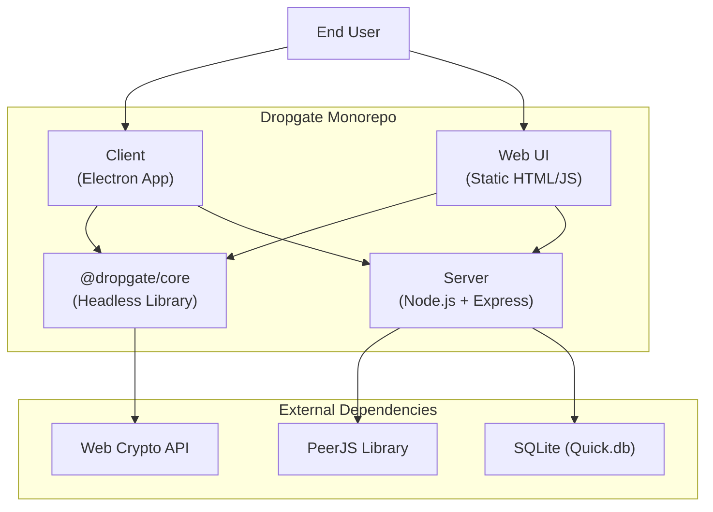
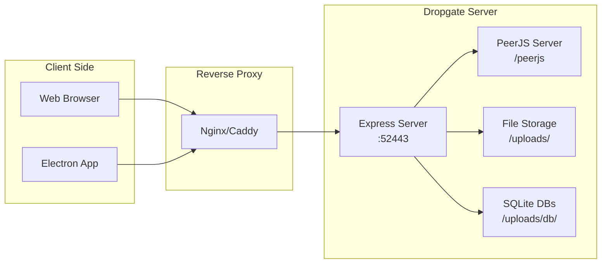

# System Architecture and Deployment Guide

**Dropgate Architecture, Integration, and Deployment**

Version: 3.0.0
Last Updated: 2026-02-05

---

## Table of Contents

1. [System Overview](#system-overview)
2. [Component Architecture](#component-architecture)
3. [API Endpoints](#api-endpoints)
4. [Deployment Architecture](#deployment-architecture)
5. [Environment Variables](#environment-variables)
6. [Reverse Proxy Configuration](#reverse-proxy-configuration)
7. [Docker Deployment](#docker-deployment)
8. [Security Hardening Checklist](#security-hardening-checklist)
9. [Capacity Planning](#capacity-planning)
10. [Monitoring Recommendations](#monitoring-recommendations)
11. [Critical Files](#critical-files)

---

## System Overview

**Dropgate** is a file sharing platform with two primary transfer mechanisms:
- **DGUP (Dropgate Upload Protocol)**: Hosted uploads with zero-knowledge encryption
- **DGDTP (Dropgate Direct Transfer Protocol)**: Peer-to-peer WebRTC transfers

### Monorepo Structure

```
Dropgate/
├── packages/
│   ├── dropgate-core/          # Headless TypeScript library
│   │   ├── src/
│   │   │   ├── client/         # DropgateClient API
│   │   │   ├── crypto/         # AES-GCM encryption/decryption
│   │   │   ├── p2p/            # DGDTP protocol implementation
│   │   │   └── zip/            # ZIP streaming
│   │   └── package.json
├── client/                        # Electron desktop app (separate)
├── server/                     # Node.js + Express server
│   ├── server.js               # Main server entry point
│   ├── public/                 # Web UI static files
│   └── uploads/                # File storage directory
├── docs/                       # Documentation
│   ├── technical/              # Technical specifications
│   ├── PRIVACY.md
│   └── TROUBLESHOOTING.md
└── package.json                # Monorepo root
```

### Technology Stack

| Component | Technology |
|-----------|------------|
| **Server** | Node.js + Express |
| **Database** | SQLite (via Quick.db) |
| **P2P Signaling** | PeerJS (WebRTC signaling) |
| **Encryption** | Web Crypto API (AES-GCM-256) |
| **Desktop Client** | Electron |
| **Web UI** | Vanilla JavaScript (no framework) |
| **Language** | TypeScript + JavaScript |

---

## Component Architecture

### Component Relationships



### @dropgate/core (Headless Library)

**Purpose**: Protocol implementations usable in any JavaScript environment

**Key exports**:
- `DropgateClient`: Main API for uploads, downloads, P2P
- Encryption/decryption functions
- P2P protocol implementations
- Type definitions

**Usage**:
```typescript
import { DropgateClient } from '@dropgate/core';

const client = new DropgateClient({
  clientVersion: '3.0.0',
  server: 'https://dropgate.link'
});

// Upload file (DGUP)
const result = await client.uploadFiles({
  files: [file],
  encrypt: true
});

// P2P send (DGDTP)
const session = await client.p2pSend({
  file: file,
  Peer: PeerJS,
  onCode: (code) => console.log('Share code:', code)
});
```

*Source: [DropgateClient.ts](../../packages/dropgate-core/src/client/DropgateClient.ts)*

### Server (Node.js + Express)

**Purpose**: API server, file storage, P2P signaling

**Key responsibilities**:
- Serve DGUP protocol endpoints
- Store uploaded files
- Host PeerJS signaling server
- Serve web UI static files
- Enforce storage quotas
- Run cleanup tasks

*Source: [server.js](../../server/server.js)*

### Client (Electron)

**Purpose**: Cross-platform desktop application

**Key features**:
- File uploads via DGUP
- P2P transfers via DGDTP
- Download management
- Clipboard integration

*Source: [client/](../../client/)*

### Web UI

**Purpose**: Browser-based interface

**Key features**:
- Upload interface
- P2P send/receive interfaces
- Download pages
- Minimal, fast, no framework

*Source: [server/public/](../../server/public/)*

---

## API Endpoints

### Complete API Reference

| Endpoint | Method | Purpose | Auth Required | Request Body | Response |
|----------|--------|---------|---------------|--------------|----------|
| **Server Info** | | | | | |
| `/api/info` | GET | Server capabilities and version | No | - | `{ name, version, logLevel, capabilities }` |
| `/api/resolve` | POST | Validate sharing code/URL | No | `{ value }` | `{ valid, type, target }` |
| **DGUP Protocol** | | | | | |
| `/upload/init` | POST | Initialize single file upload | No | `{ filename, lifetime, isEncrypted, totalSize, totalChunks, maxDownloads }` | `{ uploadId }` |
| `/upload/init-bundle` | POST | Initialize bundle upload | No | `{ fileCount, files[], lifetime, isEncrypted, maxDownloads }` | `{ bundleUploadId, fileUploadIds[] }` |
| `/upload/chunk` | POST | Upload file chunk | No (session-based) | Binary blob + Headers | `200 OK` |
| `/upload/complete` | POST | Finalize file upload | No (session-based) | `{ uploadId }` | `{ id }` |
| `/upload/complete-bundle` | POST | Finalize bundle upload | No (session-based) | `{ bundleUploadId, encryptedManifest? }` | `{ bundleId }` |
| `/upload/cancel` | POST | Cancel upload session | No (session-based) | `{ uploadId }` | `200 OK` |
| **File Download** | | | | | |
| `/api/file/{fileId}` | GET | Download file | No | - | Binary stream |
| `/api/file/{fileId}/meta` | GET | Get file metadata | No | - | `{ sizeBytes, isEncrypted }` |
| `/api/bundle/{bundleId}/meta` | GET | Get bundle metadata | No | - | Sealed: `{ encryptedManifest }` / Unsealed: `{ files[] }` |
| `/api/bundle/{bundleId}/downloaded` | POST | Increment bundle download count | No | - | `200 OK` |
| **P2P Signaling** | | | | | |
| `/peerjs/*` | ALL | PeerJS signaling server | No | WebRTC signals | WebRTC responses |

### Response Codes

| Code | Meaning | Common Scenarios |
|------|---------|------------------|
| `200` | Success | Upload chunk accepted, file downloaded |
| `400` | Bad Request | Invalid parameters, hash mismatch |
| `404` | Not Found | File doesn't exist or expired |
| `410` | Gone | Upload session expired (chunk/complete endpoints only) |
| `413` | Payload Too Large | File size exceeds limit |
| `507` | Insufficient Storage | Server out of capacity |

*Source: [server.js](../../server/server.js)*

---

## Deployment Architecture

### Deployment Diagram



### Deployment Considerations

**Required**:
- Node.js (v18+ recommended)
- Disk space (configurable, default: 10GB)
- HTTPS (required for WebRTC and Web Crypto API)

**Optional**:
- Reverse proxy (Nginx, Caddy, Apache)
- Docker containerization
- TURN server (for restrictive NAT scenarios)

**Scaling**:
- Single-server design (no built-in horizontal scaling)
- File storage local to server
- No database replication
- For high traffic: Use CDN for static files, load balancer for API

---

## Environment Variables

### Complete Environment Variables Reference

| Category | Variable | Type | Default | Description |
|----------|----------|------|---------|-------------|
| **General** | | | | |
| | `SERVER_PORT` | number | `52443` | Server port |
| | `SERVER_NAME` | string | `Dropgate Server` | Display name shown in Web UI and `/api/info` |
| | `LOG_LEVEL` | string | `INFO` | Logging verbosity: `NONE`, `ERROR`, `WARN`, `INFO`, `DEBUG` |
| | `NODE_ENV` | string | `development` | Environment: `development`, `production` |
| **Upload (DGUP)** | | | | |
| | `ENABLE_UPLOAD` | boolean | `false` | Enable hosted uploads |
| | `UPLOAD_MAX_FILE_SIZE_MB` | number | `100` | Max file size (MB), 0 = unlimited |
| | `UPLOAD_MAX_STORAGE_GB` | number | `10` | Total storage quota (GB), 0 = unlimited |
| | `UPLOAD_MAX_FILE_LIFETIME_HOURS` | number | `24` | Max file lifetime (hours), 0 = unlimited |
| | `UPLOAD_MAX_FILE_DOWNLOADS` | number | `1` | Max downloads per file, 0 = unlimited |
| | `UPLOAD_CHUNK_SIZE_BYTES` | number | `5242880` | Chunk size (bytes), default 5MB |
| | `UPLOAD_BUNDLE_SIZE_MODE` | string | `'total'` | Bundle limit mode: `'total'` or `'per-file'` |
| | `UPLOAD_PRESERVE_UPLOADS` | boolean | `false` | Persist uploads across restarts |
| | `UPLOAD_ENABLE_E2EE` | boolean | `true` | Enable end-to-end encryption |
| | `UPLOAD_ZOMBIE_CLEANUP_INTERVAL_MS` | number | `300000` | Zombie cleanup interval (ms), default 5 min |
| **P2P (DGDTP)** | | | | |
| | `ENABLE_P2P` | boolean | `true` | Enable P2P transfers |
| | `P2P_STUN_SERVERS` | string | Cloudflare | STUN server URLs (comma or space-separated) |
| | `PEERJS_DEBUG` | boolean | `false` | PeerJS verbose logging |
| **Web UI** | | | | |
| | `ENABLE_WEB_UI` | boolean | `true` | Enable web interface |

### Example Configurations

**Maximum privacy**:
```bash
SERVER_PORT=52443
LOG_LEVEL=ERROR                      # Minimal logging
ENABLE_UPLOAD=true
UPLOAD_PRESERVE_UPLOADS=false        # Clear on restart
UPLOAD_MAX_FILE_LIFETIME_HOURS=1     # 1-hour expiration
UPLOAD_MAX_FILE_DOWNLOADS=1          # One-time download
ENABLE_P2P=true
```

**Production long-term hosting**:
```bash
SERVER_PORT=52443
LOG_LEVEL=WARN
ENABLE_UPLOAD=true
UPLOAD_PRESERVE_UPLOADS=true         # Persistent storage
UPLOAD_MAX_FILE_LIFETIME_HOURS=0     # No expiration
UPLOAD_MAX_FILE_DOWNLOADS=0          # Unlimited downloads
UPLOAD_MAX_STORAGE_GB=100            # 100GB quota
ENABLE_P2P=true
```

**Disabled uploads, P2P only**:
```bash
SERVER_PORT=52443
ENABLE_UPLOAD=false                  # No hosted uploads
ENABLE_P2P=true                      # P2P only
```

---

## Reverse Proxy Configuration

### Nginx Configuration

```nginx
server {
    listen 80;
    server_name dropgate.example.com;

    # Redirect HTTP to HTTPS (required for WebRTC and Web Crypto)
    return 301 https://$server_name$request_uri;
}

server {
    listen 443 ssl http2;
    server_name dropgate.example.com;

    # SSL configuration
    ssl_certificate /path/to/cert.pem;
    ssl_certificate_key /path/to/key.pem;

    # Don't log file IDs in URLs (privacy)
    access_log off;
    # Or: access_log /var/log/nginx/access.log combined if=0;

    # Increase max body size for large uploads
    client_max_body_size 100M;

    # Main proxy
    location / {
        proxy_pass http://localhost:52443;
        proxy_http_version 1.1;

        # WebSocket support for PeerJS
        proxy_set_header Upgrade $http_upgrade;
        proxy_set_header Connection "upgrade";

        # Preserve original host and client info
        proxy_set_header Host $host;
        proxy_set_header X-Real-IP $remote_addr;
        proxy_set_header X-Forwarded-For $proxy_add_x_forwarded_for;
        proxy_set_header X-Forwarded-Proto $scheme;

        # Timeouts for long uploads
        proxy_connect_timeout 300;
        proxy_send_timeout 300;
        proxy_read_timeout 300;
    }

    # PeerJS signaling (explicit WebSocket support)
    location /peerjs/ {
        proxy_pass http://localhost:52443/peerjs/;
        proxy_http_version 1.1;
        proxy_set_header Upgrade $http_upgrade;
        proxy_set_header Connection "upgrade";
    }
}
```

### Caddy Configuration

```caddyfile
dropgate.example.com {
    # Automatic HTTPS
    reverse_proxy localhost:52443

    # Don't log (privacy)
    log {
        output discard
    }
}
```

---

## Docker Deployment

### docker-compose.yml

```yaml
version: '3.8'

services:
  dropgate:
    image: dropgate:latest
    container_name: dropgate
    restart: unless-stopped

    ports:
      - "52443:52443"

    environment:
      # General
      - NODE_ENV=production
      - SERVER_PORT=52443
      - LOG_LEVEL=WARN

      # Upload
      - ENABLE_UPLOAD=true
      - UPLOAD_PRESERVE_UPLOADS=true
      - UPLOAD_MAX_FILE_SIZE_MB=500
      - UPLOAD_MAX_STORAGE_GB=50
      - UPLOAD_MAX_FILE_LIFETIME_HOURS=72
      - UPLOAD_MAX_FILE_DOWNLOADS=10
      - UPLOAD_ENABLE_E2EE=true

      # P2P
      - ENABLE_P2P=true
      - P2P_STUN_SERVERS=stun:stun.cloudflare.com:3478

      # Web UI
      - ENABLE_WEB_UI=true

    volumes:
      # Persistent file storage
      - ./data/uploads:/app/server/uploads

    networks:
      - dropgate-net

networks:
  dropgate-net:
    driver: bridge
```

### Dockerfile

```dockerfile
FROM node:18-alpine

WORKDIR /app

# Copy package files
COPY package*.json ./
COPY packages/dropgate-core/package*.json ./packages/dropgate-core/

# Install dependencies
RUN npm ci --production

# Copy source code
COPY . .

# Build TypeScript
RUN npm run build

# Expose port
EXPOSE 52443

# Start server
CMD ["node", "server/server.js"]
```

---

## Security Hardening Checklist

### Pre-Deployment

- [ ] **HTTPS required**: Run behind reverse proxy with valid SSL certificate
- [ ] **Disable unnecessary features**: Set `ENABLE_UPLOAD=false` or `ENABLE_P2P=false` if not needed
- [ ] **Set storage limits**: Configure `UPLOAD_MAX_STORAGE_GB` to prevent disk exhaustion
- [ ] **Set file size limits**: Configure `UPLOAD_MAX_FILE_SIZE_MB` to prevent abuse
- [ ] **Minimal logging**: Set `LOG_LEVEL=ERROR` or `NONE` for privacy

### Reverse Proxy

- [ ] **Disable access logs**: Prevents logging file IDs in URLs
- [ ] **Rate limiting**: Add rate limiting on upload endpoints
- [ ] **DDoS protection**: Use Cloudflare or similar
- [ ] **Increase timeout**: Allow time for large file uploads

### Server Configuration

- [ ] **Firewall**: Only allow HTTP/HTTPS ports (80, 443)
- [ ] **Non-root user**: Run server as non-root user
- [ ] **Disk quotas**: Set OS-level disk quotas for upload directory
- [ ] **Automatic updates**: Enable automatic security updates

### Monitoring

- [ ] **Disk usage monitoring**: Alert when `/uploads/` directory exceeds threshold
- [ ] **Error monitoring**: Track 507 errors (out of capacity)
- [ ] **Uptime monitoring**: Ensure server availability

### Privacy

- [ ] **Ephemeral mode**: Use `UPLOAD_PRESERVE_UPLOADS=false` for maximum privacy
- [ ] **Short lifetimes**: Use `UPLOAD_MAX_FILE_LIFETIME_HOURS=1` or similar
- [ ] **No logging**: Configure reverse proxy and application to not log requests

---

## Capacity Planning

### Resource Estimation

| Resource | Formula | Example (100GB storage) |
|----------|---------|-------------------------|
| **Disk Space** | `UPLOAD_MAX_STORAGE_GB` + OS overhead | 100GB + 10GB = 110GB |
| **Memory** | `~100MB + (active uploads × 10MB)` | ~500MB for 40 concurrent uploads |
| **Bandwidth** | `(avg file size × downloads per hour)` | 100MB files, 100 downloads/hour = 10GB/hour |
| **CPU** | Low (mostly I/O bound) | 1-2 cores sufficient for most workloads |

### Disk Space Calculations

```javascript
// Total storage needed
const baseStorage = UPLOAD_MAX_STORAGE_GB;           // 100GB
const tempStorage = 0.2 * baseStorage;               // 20GB (20% for temp files)
const databaseStorage = 0.01 * baseStorage;          // 1GB (1% for metadata)
const osStorage = 10;                                 // 10GB (OS overhead)
const totalStorage = baseStorage + tempStorage + databaseStorage + osStorage;
// Total: 131GB
```

### Concurrent Upload Limits

**Default**:
- No explicit limit on concurrent uploads
- Limited by `UPLOAD_MAX_STORAGE_GB` quota
- Each upload reserves space immediately

**Example**:
- Max storage: 100GB
- Already used: 80GB
- New 25GB upload → Rejected (507 Insufficient Storage)

### Performance Tuning

**For high traffic**:
- Use SSD for `/uploads/` directory (faster I/O)
- Increase Node.js max memory: `node --max-old-space-size=4096 server/server.js`
- Use reverse proxy caching for static files
- Consider CDN for web UI

**For low latency**:
- Use smaller chunk sizes (faster first byte)
- Reduce cleanup intervals (more responsive)
- Use in-memory database mode (faster metadata access)

---

## Monitoring Recommendations

### Key Metrics to Track

**Disk Usage**:
```bash
# Monitor /uploads/ directory size
du -sh /server/uploads/
```

**Upload Success Rate**:
- Count completed uploads vs initiated uploads
- Track 507 errors (capacity issues)

**P2P Connection Success Rate**:
- Track successful P2P connections vs attempts
- Monitor PeerJS signaling errors

**Cleanup Effectiveness**:
- Track zombie uploads cleaned per interval
- Track expired files cleaned per interval

**Response Times**:
- Monitor `/api/info` response time (health check)
- Monitor chunk upload times

### Health Check Endpoint

```bash
# Use /api/info as health check
curl https://dropgate.example.com/api/info

# Expected response: 200 OK
{
  "version": "3.0.0",
  "capabilities": { ... }
}
```

### Log Monitoring

**At WARN level**:
```bash
# Monitor logs for capacity warnings
tail -f /var/log/dropgate.log | grep "507\|Insufficient"
```

**At ERROR level**:
```bash
# Monitor for errors
tail -f /var/log/dropgate.log | grep "ERROR"
```

---

## Critical Files

### Server Files

| File | Purpose | Lines |
|------|---------|-------|
| [server.js](../../server/server.js) | Main server entry point, all API endpoints | 1410 lines |
| [package.json](../../package.json) | Monorepo dependencies and scripts | - |

### Core Library Files

| File | Purpose |
|------|---------|
| [DropgateClient.ts](../../packages/dropgate-core/src/client/DropgateClient.ts) | Headless client API |
| [encrypt.ts](../../packages/dropgate-core/src/crypto/encrypt.ts) | AES-GCM encryption |
| [protocol.ts](../../packages/dropgate-core/src/p2p/protocol.ts) | DGDTP message definitions |
| [send.ts](../../packages/dropgate-core/src/p2p/send.ts) | P2P sender implementation |
| [receive.ts](../../packages/dropgate-core/src/p2p/receive.ts) | P2P receiver implementation |

### Configuration Files

| File | Purpose |
|------|---------|
| `.env` | Environment variables (not in repo) |
| `docker-compose.yml` | Docker deployment configuration |
| `Dockerfile` | Docker image definition |

---

**End of System Architecture and Deployment Guide**

For questions or contributions, see the [main documentation index](./README.md).
