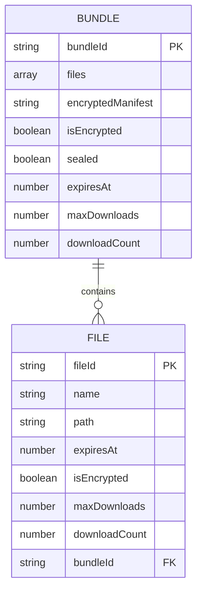
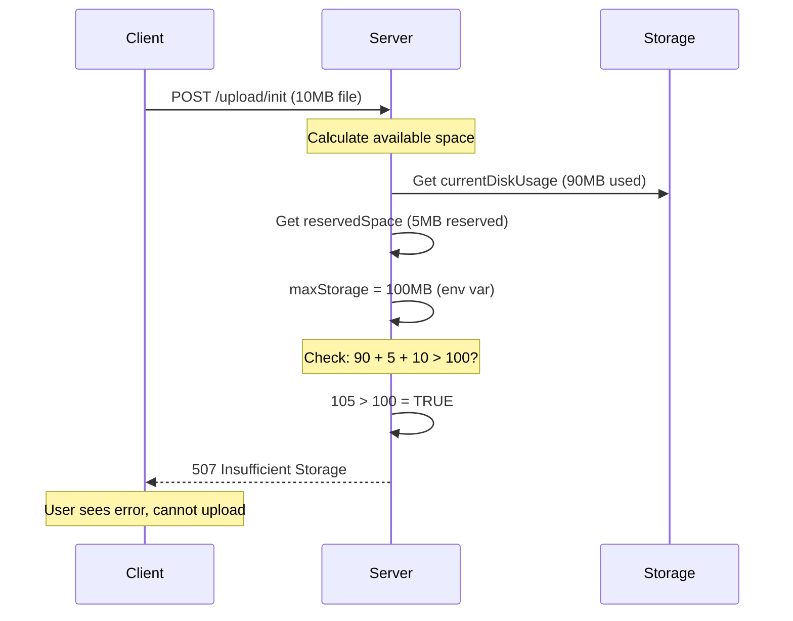

# Data Lifecycle and Privacy Architecture

**Dropgate Data Processing, Storage, and Privacy Documentation**

Version: 3.0.0
Last Updated: 2026-02-05

---

## Table of Contents

1. [Zero-Knowledge Architecture Overview](#zero-knowledge-architecture-overview)
2. [Data Inventory](#data-inventory)
3. [Database Schema](#database-schema)
4. [Upload Lifecycle](#upload-lifecycle)
5. [Download Lifecycle](#download-lifecycle)
6. [Three Cleanup Mechanisms](#three-cleanup-mechanisms)
7. [Server Blindness Guarantees](#server-blindness-guarantees)
8. [Storage Quota Management](#storage-quota-management)
9. [Logging and Privacy](#logging-and-privacy)
10. [Data Persistence Configuration](#data-persistence-configuration)
11. [Compliance Considerations](#compliance-considerations)
12. [Critical Files](#critical-files)

---

## Zero-Knowledge Architecture Overview

### Core Principle

**Zero-knowledge architecture**: A system where the server operator cannot access the plaintext content of user data, even with full server access.

### Dropgate Implementation

1. **Client-side encryption**: Files encrypted in browser before transmission
2. **Key isolation**: Encryption keys stored in URL fragment (never transmitted to server)
3. **Encrypted filenames**: Server sees encrypted base64 strings, not original names
4. **Sealed manifests**: Bundle file lists encrypted as opaque blobs
5. **No key escrow**: No mechanism for server to recover encryption keys

### What This Means

**For users**:
- Files remain private even if server is compromised
- Server operator cannot read file contents
- No trust required in server security (for content confidentiality)

**For server operators**:
- Cannot comply with content disclosure requests (literally unable to decrypt)
- Cannot moderate content
- Cannot scan for malware or prohibited content

**Limitations**:
- Server can see metadata (file sizes, upload/download times, counts)
- For unsealed bundles, server can see file list
- Zero-knowledge applies only to encrypted uploads

*Source: [DGUP-PROTOCOL.md](./DGUP-PROTOCOL.md#security-guarantees)*

---

## Data Inventory

### Complete Data Inventory Table

| Data Type | Location | Format | Persistence | Why Stored | When Deleted |
|-----------|----------|--------|-------------|------------|--------------|
| **Uploaded file binary** | `/server/uploads/{fileId}` | Encrypted or plaintext binary | Configurable | Serve to downloaders | On expiration or download limit |
| **Temporary chunk files** | `/server/uploads/tmp/{uploadId}` | Sparse binary file | Ephemeral | Reassemble chunks during upload | On completion or 2-min timeout |
| **File metadata** | SQLite: `file-database.sqlite` | JSON-like record | Configurable | Track expiration, downloads, encryption status | With file deletion |
| **Bundle metadata** | SQLite: `bundle-database.sqlite` | JSON-like record | Configurable | Group files, track manifest | On bundle expiration |
| **Encrypted manifest** | SQLite: `encryptedManifest` field | Base64-encoded encrypted blob | Configurable | Zero-knowledge bundle structure | With bundle deletion |
| **Upload sessions** | In-memory: `ongoingUploads` Map | JavaScript object | Never persisted | Track active uploads, prevent zombies | On completion or timeout |
| **Bundle sessions** | In-memory: `ongoingBundles` Map | JavaScript object | Never persisted | Track active bundles | On completion or timeout |
| **P2P signaling** | PeerJS server memory | WebRTC signals | Ephemeral | Coordinate WebRTC connections | On connection close |

### Data Not Stored

**Never stored by Dropgate**:
- User accounts or identities
- Authentication credentials (no auth system)
- Client IP addresses (unless reverse proxy logs)
- Session cookies
- User activity history
- Cross-upload correlations

**Ephemeral only**:
- WebRTC signaling data (PeerJS)
- In-memory upload session state
- HTTP request/response details (unless logged)

---

## Database Schema

### Entity Relationship Diagram



### File Record Schema

```typescript
interface FileRecord {
  fileId: string;           // UUID primary key
  name: string;            // encrypted base64 OR plaintext
  path: string;            // filesystem path: /uploads/{fileId}
  expiresAt: number | null; // Unix timestamp or null (unlimited)
  isEncrypted: boolean;     // encryption flag
  maxDownloads: number;     // 0 = unlimited
  downloadCount?: number;   // only tracked if maxDownloads > 0
  bundleId?: string;        // UUID if part of bundle
}
```

**Example (encrypted)**:
```json
{
  "fileId": "3aac88a3-7f24-4378-91d2-3d76ede1870d",
  "name": "kj3h4k5j6lm7n8p9==",
  "path": "/server/uploads/3aac88a3-7f24-4378-91d2-3d76ede1870d",
  "expiresAt": 1735891200000,
  "isEncrypted": true,
  "maxDownloads": 1,
  "downloadCount": 0
}
```

**Example (plaintext)**:
```json
{
  "fileId": "uuid",
  "name": "document.pdf",
  "path": "/server/uploads/uuid",
  "expiresAt": null,
  "isEncrypted": false,
  "maxDownloads": 0
}
```

*Source: [server.js:735-767](../../server/server.js#L735-L767)*

### Bundle Record Schema

**Sealed Bundle** (zero-knowledge):
```typescript
interface SealedBundleRecord {
  bundleId: string;
  encryptedManifest: string;  // base64 encrypted JSON blob
  isEncrypted: true;
  sealed: true;
  expiresAt: number | null;
  maxDownloads: number;
  downloadCount?: number;
}
```

**Example**:
```json
{
  "bundleId": "bundle-uuid",
  "encryptedManifest": "a1b2c3d4e5f6g7h8i9j0...",
  "isEncrypted": true,
  "sealed": true,
  "expiresAt": 1735891200000,
  "maxDownloads": 5
}
```

**Unsealed Bundle**:
```typescript
interface UnsealedBundleRecord {
  bundleId: string;
  files: Array<{
    fileId: string;
    name: string;
    sizeBytes: number;
  }>;
  isEncrypted: boolean;
  expiresAt: number | null;
  maxDownloads: number;
  downloadCount?: number;
}
```

**Example**:
```json
{
  "bundleId": "bundle-uuid",
  "files": [
    { "fileId": "file1-uuid", "name": "file1.pdf", "sizeBytes": 5000 },
    { "fileId": "file2-uuid", "name": "file2.txt", "sizeBytes": 3000 }
  ],
  "isEncrypted": false,
  "expiresAt": null,
  "maxDownloads": 0
}
```

*Source: [server.js:817-906](../../server/server.js#L817-L906)*

---

## Upload Lifecycle

### Complete Upload Lifecycle Flowchart

```mermaid
flowchart TD
    A[Client: POST /upload/init] --> B[Server: Check storage quota]
    B --> C{Space available?}
    C -->|No| D[507 Insufficient Storage]
    C -->|Yes| E[Create temp file /tmp/{uploadId}]
    E --> F[Reserve storage in currentDiskUsage]
    F --> G[Add to ongoingUploads Map]
    G --> H[Return uploadId]
    H --> I[Client: Upload chunks]

    I --> J{All chunks received?}
    J -->|No| K[Wait for next chunk<br/>Reset 2-min timeout]
    K --> I

    J -->|Yes| L[POST /upload/complete]
    L --> M[Verify all chunks in receivedChunks Set]
    M --> N[Verify file size matches totalSize]
    N --> O[Move from /tmp/ to /uploads/{fileId}]
    O --> P[Create record in file-database.sqlite]
    P --> Q[Set expiresAt timestamp]
    Q --> R[Remove from ongoingUploads]
    R --> S[File ready for download]

    S --> T{Time-based expiration?}
    T -->|expiresAt reached| U[cleanupExpiredFiles runs]
    U --> V[Delete file + DB record]

    S --> W{Download-based expiration?}
    W -->|downloadCount >= maxDownloads| X[Delete after download]

    K --> Y{2-min timeout reached?}
    Y -->|Yes| Z[cleanupZombieUploads runs]
    Z --> AA[Delete temp file<br/>Remove from Map]

    V --> AB[Update currentDiskUsage]
    X --> AB
    AA --> AB
```

### Phase Breakdown

| Phase | State | Duration | Key Actions |
|-------|-------|----------|-------------|
| **Initialization** | Session created | <1s | Reserve quota, create temp file |
| **Chunk Reception** | Receiving | Variable | Write chunks to temp file, verify hashes |
| **Completion** | Finalizing | <1s | Move to final location, create DB record |
| **Ready for Download** | Live | Until expiration | File available for download |
| **Expiration** | Cleanup | N/A | Delete file, free space |

### Upload Session Timeouts

- **Individual file**: 2 minutes since last chunk received
- **Bundle**: 10 minutes for entire bundle session
- **Chunk refresh**: Each chunk resets the timer
- **Sibling sync**: In bundles, each chunk resets ALL sibling file timers

**Example** (bundle with 3 files):
1. Upload chunk for file 1 → resets timers for files 1, 2, 3
2. Wait 1.5 minutes
3. Upload chunk for file 2 → resets timers for files 1, 2, 3
4. Result: No timeout despite 1.5-minute gap

*Source: [server.js:693-703](../../server/server.js#L693-L703)*

---

## Download Lifecycle

### Download Sequence Diagram

```mermaid
sequenceDiagram
    participant Client
    participant Server
    participant DB as Database
    participant FS as Filesystem

    Client->>Server: GET /api/file/{fileId}
    Server->>DB: Lookup file record

    alt File not found
        DB-->>Server: null
        Server-->>Client: 404 Not Found
    else File found
        DB-->>Server: file record

        else Valid
            Server->>FS: Read file stream
            FS-->>Server: Binary chunks
            Server-->>Client: Stream file data

            alt File belongs to bundle
                Note over Server: No download count increment<br/>Bundle tracks downloads separately
            else maxDownloads = 0 (unlimited)
                Note over Server: No count tracking
            else maxDownloads > 0
                Server->>Server: Increment downloadCount

                alt downloadCount >= maxDownloads
                    Server->>FS: Delete file
                    Server->>DB: Delete record
                    Note over Server: Auto-delete after last download
                else Still available
                    Server->>DB: Update downloadCount
                end
            end
        end
    end
```

### Download Validation Checks

**Pre-download checks** (in order):
1. **File exists in DB**: `fileDatabase.get(fileId) !== null`
2. **E2EE check**: If file is encrypted and `UPLOAD_ENABLE_E2EE` is disabled, return 404
3. **File exists on disk**: `fs.statSync(fileInfo.path)` succeeds

> **Note**: Expiration is NOT checked inline during downloads. Expired files are cleaned up by the `cleanupExpiredFiles()` timer (every 60s). Download limits are enforced post-download: once `downloadCount >= maxDownloads`, the file is deleted, so subsequent requests will hit check #1 (404). The server never returns 410 Gone.

**Response codes**:
- `404 Not Found`: File doesn't exist, already deleted (expiry or download limit), or E2EE disabled
- `200 OK`: File streamed successfully

### Post-Download Actions

```javascript
// After successful stream
const newDownloadCount = (fileRecord.downloadCount || 0) + 1;
const maxDl = fileRecord.maxDownloads ?? 1;

if (maxDl > 0 && newDownloadCount >= maxDl) {
  // Delete file immediately
  fs.rm(fileRecord.path, { force: true });
  fileDatabase.delete(fileId);
  currentDiskUsage = Math.max(0, currentDiskUsage - fileSize);
} else {
  // Update count
  fileDatabase.set(fileId, { ...fileRecord, downloadCount: newDownloadCount });
}
```

*Source: [server.js:974-992](../../server/server.js#L974-L992)*

---

## Three Cleanup Mechanisms

### Cleanup Process Timing

```
Cleanup Timing Overview:

Expired Files Timer:        Every 60 seconds
├── 0s ──── 60s ──── 120s ──── 180s ──── 240s ──── 300s ────→
    [scan]   [scan]   [scan]    [scan]    [scan]    [scan]

Zombie Uploads Timer:       Every 300 seconds (5 min)
├── 0s ─────────────────────────────────── 300s ────────────→
    [scan]                                  [scan]

Download-Triggered:         Immediate (event-driven)
├── on download ──→ check downloadCount ──→ delete if maxed
```

### Cleanup Mechanisms Table

| Mechanism | Trigger | Interval | Scope | Purpose |
|-----------|---------|----------|-------|---------|
| **Expired Files** | Timer | 60 seconds | Completed uploads with `expiresAt` past | Time-based expiration |
| **Zombie Uploads** | Timer | 300 seconds (5 min) | Active upload sessions with 2-min timeout | Free stalled uploads |
| **Download-Triggered** | Event | Immediate | Files with `downloadCount >= maxDownloads` | Count-based expiration |

### Cleanup Mechanism 1: Expired Files

**Function**: `cleanupExpiredFiles()`
**Interval**: Every 60 seconds

```javascript
async function cleanupExpiredFiles() {
  const now = Date.now();

  // Check files (QuickDB .all() returns Array<{ id, value }>)
  const allFiles = await fileDatabase.all();
  for (const record of allFiles) {
    if (record.value?.expiresAt && record.value.expiresAt < now) {
      // Skip files that belong to a bundle (cleaned up with the bundle)
      if (record.value.bundleId) continue;

      const stats = fs.statSync(record.value.path);
      currentDiskUsage = Math.max(0, currentDiskUsage - stats.size);
      fs.rmSync(record.value.path, { force: true });
      await fileDatabase.delete(record.id);
    }
  }

  // Check bundles
  const allBundles = await bundleDatabase.all();
  for (const record of allBundles) {
    if (record.value?.expiresAt && record.value.expiresAt < now) {
      if (record.value.sealed) {
        // Sealed: just delete manifest record (member files are independent)
      } else {
        // Unsealed: cascade-delete all member files
        for (const f of (record.value.files || [])) {
          const fileInfo = await fileDatabase.get(f.fileId);
          if (fileInfo) {
            const stats = fs.statSync(fileInfo.path);
            currentDiskUsage = Math.max(0, currentDiskUsage - stats.size);
            fs.rmSync(fileInfo.path, { force: true });
            await fileDatabase.delete(f.fileId);
          }
        }
      }
      // Delete bundle record (sealed or unsealed)
      await bundleDatabase.delete(record.id);
    }
  }
}
```

**Key behavior**:
- **Files with `bundleId`**: Skipped by file cleanup (cleaned up with the bundle instead)
- **Unsealed bundles**: Cascade-delete all member files
- **Sealed bundles**: Delete only manifest record (member files have no `bundleId` and expire independently via the file cleanup loop)

*Source: [server.js:1282-1325](../../server/server.js#L1282-L1325)*

### Cleanup Mechanism 2: Zombie Uploads

**Function**: `cleanupZombieUploads()`
**Interval**: Every 300 seconds (5 min, configurable via `UPLOAD_ZOMBIE_CLEANUP_INTERVAL_MS`)

```javascript
function cleanupZombieUploads() {
  const now = Date.now();

  // Clean individual upload sessions
  for (const [uploadId, session] of ongoingUploads.entries()) {
    if (now > session.expiresAt) {
      // Check if part of active bundle
      if (session.bundleUploadId && ongoingBundles.has(session.bundleUploadId)) {
        continue;  // Skip, let bundle manage
      }

      // Orphan or bundle dead - delete temp file
      fs.rmSync(session.tempFilePath, { force: true });
      ongoingUploads.delete(uploadId);
    }
  }

  // Clean bundle sessions
  for (const [bundleId, bundleSession] of ongoingBundles.entries()) {
    if (now > bundleSession.expiresAt) {
      // Delete all sibling temp files
      for (const fileUploadId of bundleSession.fileUploadIds) {
        const uploadSession = ongoingUploads.get(fileUploadId);
        if (uploadSession) {
          fs.rmSync(uploadSession.tempFilePath, { force: true });
          ongoingUploads.delete(fileUploadId);
        }
      }

      // Delete any already-completed files from this bundle
      for (const result of (bundleSession.completedFileResults || [])) {
        const fileInfo = fileDatabase.get(result.fileId);
        if (fileInfo) {
          const stats = fs.statSync(fileInfo.path);
          currentDiskUsage = Math.max(0, currentDiskUsage - stats.size);
          fs.rmSync(fileInfo.path, { force: true });
          fileDatabase.delete(result.fileId);
        }
      }

      ongoingBundles.delete(bundleId);
    }
  }
}
```

**Purpose**: Clean up stalled uploads from disconnected clients.

*Source: [server.js:1327-1370](../../server/server.js#L1327-L1370)*

### Cleanup Mechanism 3: Download-Triggered

**Trigger**: After successful file download (in the `readStream.on('close')` handler)
**Condition**: `maxDownloads > 0 && downloadCount >= maxDownloads`

```javascript
// Skip download counting for bundle member files
// (bundle downloads tracked separately via /api/bundle/:bundleId/downloaded)
if (fileInfo.bundleId) return;

const newDownloadCount = (fileInfo.downloadCount || 0) + 1;
const maxDl = fileInfo.maxDownloads ?? 1;

if (maxDl > 0 && newDownloadCount >= maxDl) {
  currentDiskUsage = Math.max(0, currentDiskUsage - fileSize);
  fs.rm(fileInfo.path, { force: true }, () => {});
  await fileDatabase.delete(fileId);
} else {
  await fileDatabase.set(fileId, { ...fileInfo, downloadCount: newDownloadCount });
}
```

**Bundle downloads**: Bundles track downloads separately via `POST /api/bundle/:bundleId/downloaded`. When the download limit is reached:
- **Sealed bundles**: Only the manifest record is deleted. Member files expire independently.
- **Unsealed bundles**: All member files and the bundle record are deleted.

**Use cases**:
- **One-time downloads** (`maxDownloads = 1`): Self-destruct after first download
- **Limited sharing** (`maxDownloads = 5`): Delete after 5 downloads
- **Unlimited** (`maxDownloads = 0`): Never delete based on count

---

## Server Blindness Guarantees

### What Server Can/Cannot See

| Data Element | Can Server Access? | Technical Reason | Privacy Implication |
|--------------|-------------------|------------------|---------------------|
| **File plaintext content** | ❌ No | Encrypted with AES-GCM, key never sent to server | Server operator cannot read files |
| **Encryption key** | ❌ No | Stored in URL hash fragment (never transmitted in HTTP request) | Keys isolated to client |
| **Original filename** | ❌ No | Encrypted to base64 string before transmission | Server sees `"kj3h4k5j6=="`, not `"document.pdf"` |
| **Bundle file list (sealed)** | ❌ No | Manifest encrypted as opaque blob | Cannot enumerate files in sealed bundles |
| **Bundle file list (unsealed)** | ✅ Yes | Stored as plaintext array in database | Trade-off for convenience |
| **File size** | ✅ Yes | Required for storage quota enforcement | Metadata leakage (unavoidable) |
| **Upload timestamp** | ✅ Yes | Implicit in `expiresAt - lifetime` calculation | Metadata leakage |
| **Download count** | ✅ Yes | Tracked for deletion logic | Metadata leakage |
| **Client IP address** | ⚠️ Maybe | Depends on `LOG_LEVEL` and reverse proxy configuration | Not logged by default at INFO or below |
| **URL fragments (#key)** | ❌ No | Browser doesn't send hash fragment in HTTP request (RFC 3986) | Keys never reach server logs or network |

### Zero-Knowledge Guarantees

**For encrypted uploads with sealed manifests**:
1. Server cannot decrypt file content
2. Server cannot decrypt filenames
3. Server cannot enumerate bundle contents
4. Server cannot correlate files by metadata
5. Server has no mechanism to recover keys

**Limitations**:
- Metadata visible: file sizes, timing, download counts
- Unsealed bundles: file list visible
- No protection against traffic analysis (file sizes leak information)

### Why Server Can See File Sizes

**Technical necessity**:
```javascript
// Quota enforcement requires knowing file size
if (currentDiskUsage + reservedSpace + newFileSize > maxStorage) {
  return 507 Insufficient Storage;
}
```

**Cannot avoid**:
- Disk space is finite
- Must prevent abuse
- Quota enforcement requires size knowledge

**Privacy impact**: File size can reveal file type (e.g., 4.7GB suggests DVD rip).

---

## Storage Quota Management

### Quota Enforcement Sequence



### Quota Calculation

```javascript
// Metrics
const currentDiskUsage = await getDirSize('/uploads/');
const reservedSpace = Array.from(ongoingUploads.values())
  .reduce((sum, session) => sum + session.reservedBytes, 0);
const maxStorage = UPLOAD_MAX_STORAGE_GB * 1_000_000_000;
const availableSpace = maxStorage - currentDiskUsage - reservedSpace;

// On upload init
if (newFileSize > availableSpace) {
  return res.status(507).json({ error: 'Insufficient storage' });
}

// Reserve space
ongoingUploads.set(uploadId, {
  ...sessionData,
  reservedBytes: newFileSize
});
```

### Disk Usage Synchronization

**Frequency**: Every 5 minutes

```javascript
setInterval(async () => {
  currentDiskUsage = await getDirSize('/uploads/');
  currentDiskUsage = Math.max(0, currentDiskUsage);  // Clamp to 0
}, 5 * 60 * 1000);
```

**Purpose**:
- Correct drift from calculation errors
- Account for external file deletions
- Prevent negative disk usage (edge case)

*Source: [server.js:388-495](../../server/server.js#L388-L495)*

---

## Logging and Privacy

### Logging Behavior by Level

| Log Level | What Gets Logged | Privacy Impact |
|-----------|------------------|----------------|
| `NONE` | Nothing | ✅ Maximum privacy (no logs at all) |
| `ERROR` | Errors only (no file IDs, session IDs, or client IPs) | ✅ Minimal metadata leakage |
| `WARN` | Warnings (quota exceeded, cleanup events) | ⚠️ Capacity events visible, no user data |
| `INFO` | Lifecycle events (upload start, download, expiration) | ⚠️ Upload/download patterns visible (no specific file IDs) |
| `DEBUG` | Full details (file IDs, chunk counts, session IDs, sizes) | ❌ Metadata leakage (still no content or keys) |

### What is NEVER Logged (Even at DEBUG)

Dropgate never logs:
- **File content** (encrypted or plaintext)
- **Encryption keys**
- **URL hash fragments** (keys in `#key=...`)
- **Client IP addresses** (unless reverse proxy adds them)
- **User identifiers** (Dropgate has no user accounts)
- **Request bodies** (file data)

### What MAY Be Logged (at DEBUG)

- File IDs (UUIDs)
- Upload session IDs (UUIDs)
- Chunk counts and sizes
- Expiration timestamps
- Download counts
- File sizes (for quota calculations)

### Recommendations for Public Instances

**Maximum privacy**:
```bash
LOG_LEVEL=NONE              # No logs at all
UPLOAD_PRESERVE_UPLOADS=false   # Clear on restart
```

**Production with minimal logging**:
```bash
LOG_LEVEL=ERROR             # Errors only
```

**Reverse proxy**:
```nginx
# Nginx: Disable access logs (file IDs in URLs)
access_log off;
```

*Source: Logging handled by server framework, not explicitly visible in code*

---

## Data Persistence Configuration

### Persistence Modes

| Mode | `UPLOAD_PRESERVE_UPLOADS` | Database Type | Filesystem | Behavior on Restart |
|------|---------------------------|---------------|------------|---------------------|
| **Ephemeral** (default) | `false` | In-memory SQLite | Temp, cleared | All uploads deleted, databases reset |
| **Persistent** | `true` | Disk-based SQLite | Persists | Uploads and metadata survive restart |

### Ephemeral Mode (Default)

**Database initialization**:
```javascript
const fileDatabase = new QuickDB({ driver: new MemoryDriver() });
const bundleDatabase = new QuickDB({ driver: new MemoryDriver() });
```

**Cleanup on shutdown**:
```javascript
const handleShutdown = () => {
  if (enableUpload && !preserveUploads) {
    cleanupDir(tmpDir);    // Delete temp files
    cleanupDir(uploadDir); // Delete all uploaded files
  }
  server.close(() => process.exit(0));
  setTimeout(() => process.exit(0), 1500).unref();
};

process.on('SIGINT', handleShutdown);
process.on('SIGTERM', handleShutdown);
```

> **Note**: `cleanupDir()` iterates directory entries and deletes each file/directory individually using `fs.rmSync()` with `{ recursive: true, force: true }`. It does not delete the upload directory itself.

**Characteristics**:
- Maximum privacy (all data lost on restart)
- Temporary file sharing
- No long-term storage
- Automatic cleanup

**Use case**: Privacy-focused instances, temporary sharing.

*Source: [server.js:153-179](../../server/server.js#L153-L179)*

### Persistent Mode

**Database initialization**:
```javascript
const fileDatabase = new QuickDB({
  filePath: '/server/uploads/db/file-database.sqlite'
});
const bundleDatabase = new QuickDB({
  filePath: '/server/uploads/db/bundle-database.sqlite'
});
```

**Characteristics**:
- Uploads survive server restarts
- Databases stored on disk
- Cleanup policies still apply (expiration, download count)

**Use case**: Long-term file hosting, production stability.

### Filesystem Layout

```
/server/uploads/
├── db/                              # Database files (if persistent)
│   ├── file-database.sqlite
│   └── bundle-database.sqlite
├── tmp/                             # Temporary chunk files (ephemeral)
│   └── [uploadId files during upload]
└── [fileId files]                   # Final uploaded files (UUIDs)
    ├── 3aac88a3-7f24-4378-91d2-3d76ede1870d
    ├── 7b5e32f1-9a8d-4c67-b1e2-4f8a9d7c3e21
    └── ...
```

---

## Compliance Considerations

### GDPR (EU General Data Protection Regulation)

**Article 15 - Right to access**:
- **Encrypted uploads**: Server operator cannot access plaintext content
- **Compliance**: Operator cannot provide decrypted content (literally unable)

**Article 17 - Right to deletion**:
- **Automatic expiration**: Files deleted after configurable lifetime (default: 24h)
- **Download-based deletion**: Files deleted after N downloads
- **Manual deletion**: No built-in endpoint (by design, to prevent abuse)

**Article 5 - Data minimization**:
- Only metadata required for functionality is stored (size, expiration, count)
- No user accounts, tracking, or analytics
- Minimal logging (ERROR level recommended)

**Article 5 - Purpose limitation**:
- Data used only for file sharing
- No secondary use, analysis, or monetization
- No cross-upload correlation

**Article 5 - Storage limitation**:
- Configurable expiration (`UPLOAD_MAX_FILE_LIFETIME_HOURS`, default: 24)
- Automatic cleanup every 60 seconds
- Download-based deletion

### Zero-Knowledge Claim

**Valid for**:
- Encrypted uploads (`isEncrypted: true`)
- Sealed bundle manifests
- Encrypted filenames

**Server cannot**:
- Decrypt file content without key
- Decrypt filenames without key
- Enumerate sealed bundle contents without key
- Recover keys (no escrow mechanism)

**Caveat**:
- Server can see file sizes (required for quota)
- Server can see upload/download timing (metadata)
- Unsealed bundles expose file list

### Data Retention Policies

**Default policy**:
```bash
UPLOAD_MAX_FILE_LIFETIME_HOURS=24      # Files expire after 24 hours
UPLOAD_MAX_FILE_DOWNLOADS=1            # Delete after 1 download
```

**Configurable**:
- Time-based: 0 = unlimited lifetime
- Download-based: 0 = unlimited downloads

**Example policies**:
```bash
# Maximum privacy: ephemeral, 1-hour lifetime, one-time download
UPLOAD_PRESERVE_UPLOADS=false
UPLOAD_MAX_FILE_LIFETIME_HOURS=1
UPLOAD_MAX_FILE_DOWNLOADS=1

# Long-term sharing: persistent, no expiration
UPLOAD_PRESERVE_UPLOADS=true
UPLOAD_MAX_FILE_LIFETIME_HOURS=0
UPLOAD_MAX_FILE_DOWNLOADS=0
```

### Transparency Recommendations

For public instances, provide users with:
1. **Privacy policy** explaining zero-knowledge architecture
2. **Retention policy** stating expiration times
3. **Metadata disclosure** explaining what server can see (sizes, timing)
4. **Log level disclosure** stating `LOG_LEVEL` configuration
5. **Encryption recommendation** encouraging E2EE uploads

---

## Critical Files

### Source Code References

| File | Purpose | Lines |
|------|---------|-------|
| [server.js](../../server/server.js) | Server-side upload handling, cleanup, download logic | 1410 lines |
| [server.js:153-179](../../server/server.js#L153-L179) | Database initialization (persistent vs ephemeral) | 27 lines |
| [server.js:388-634](../../server/server.js#L388-L634) | Upload endpoints (init, chunk, complete) | 247 lines |
| [server.js:908-1078](../../server/server.js#L908-L1078) | Download endpoints and deletion logic | 171 lines |
| [server.js:1282-1325](../../server/server.js#L1282-L1325) | Expired files cleanup | 44 lines |
| [server.js:1327-1370](../../server/server.js#L1327-L1370) | Zombie uploads cleanup | 44 lines |
| [types.ts](../../packages/dropgate-core/src/types.ts) | TypeScript type definitions for metadata | - |

### Related Documentation

- [DGUP-PROTOCOL.md](./DGUP-PROTOCOL.md) - Upload protocol specification
- [DGDTP-PROTOCOL.md](./DGDTP-PROTOCOL.md) - P2P protocol specification
- [ARCHITECTURE.md](./ARCHITECTURE.md) - System architecture and deployment

---

**End of Data Lifecycle and Privacy Architecture Documentation**

For questions or contributions, see the [main documentation index](./README.md).
