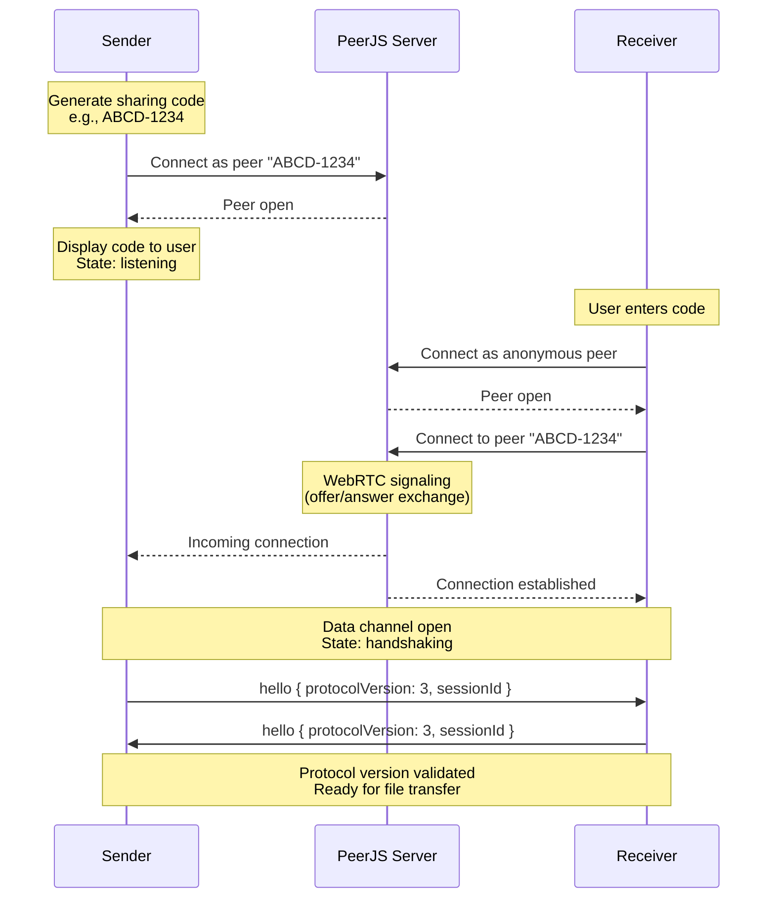
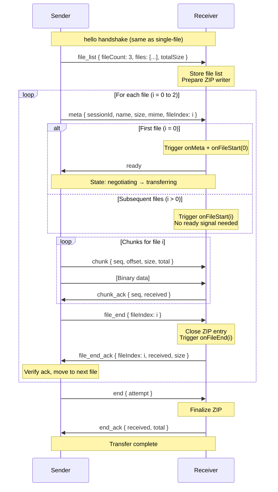
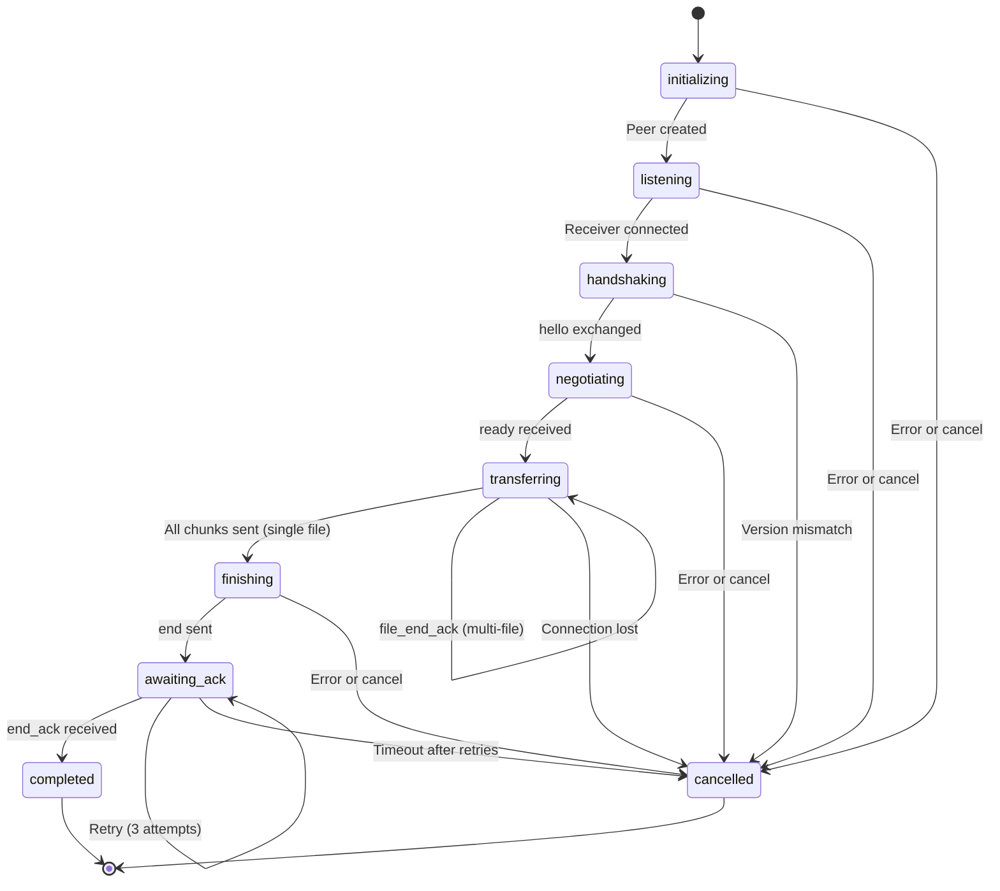
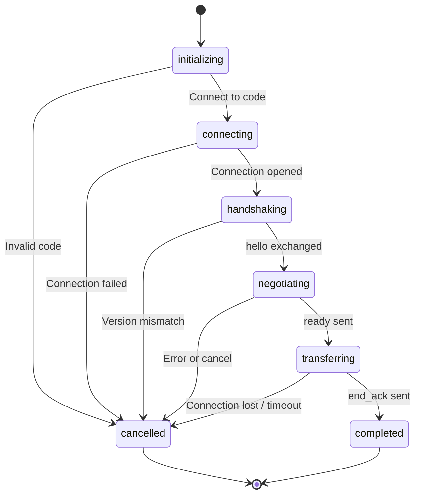
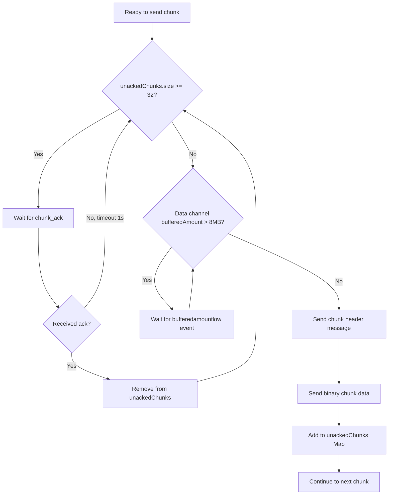

# DGDTP Protocol Specification

**Dropgate Direct Transfer Protocol**

Version: 3 (Protocol v3)
Protocol Identifier: DGDTP
Last Updated: 2026-02-05

---

## Table of Contents

1. [Protocol Overview](#protocol-overview)
2. [Connection Establishment](#connection-establishment)
3. [DGDTP Protocol v3 Specification](#dgdtp-protocol-v3-specification)
4. [Protocol Flow - Single File Transfer](#protocol-flow---single-file-transfer)
5. [Protocol Flow - Multi-File Transfer](#protocol-flow---multi-file-transfer)
6. [State Machine - Sender](#state-machine---sender)
7. [State Machine - Receiver](#state-machine---receiver)
8. [Flow Control and Reliability](#flow-control-and-reliability)
9. [Connection Health and Heartbeat](#connection-health-and-heartbeat)
10. [End Acknowledgment Retry Mechanism](#end-acknowledgment-retry-mechanism)
11. [Security Considerations](#security-considerations)
12. [Error Handling and Cancellation](#error-handling-and-cancellation)
13. [Multi-File Transfer Implementation](#multi-file-transfer-implementation)
14. [API Reference - Client SDK](#api-reference---client-sdk)
15. [Implementation Notes](#implementation-notes)

---

## Protocol Overview

**DGDTP (Dropgate Direct Transfer Protocol)** is a peer-to-peer file transfer protocol built on WebRTC. It enables direct, real-time file transfers between two peers without server storage.

### Design Philosophy

- **Direct peer-to-peer**: Files transfer directly between sender and receiver
- **Server as signaling only**: Server coordinates connection, never touches file data
- **WebRTC foundation**: Built on DTLS-encrypted data channels
- **Flow control**: Chunk-level acknowledgments prevent overwhelming receiver
- **Reliability**: Multi-layer retry mechanisms ensure completion

### Protocol Version History

| Version | Features |
|---------|----------|
| **v3** (current) | Multi-file transfers, file boundaries, per-file acknowledgments |
| **v2** | Chunk acknowledgments, end-ack retries, heartbeat |
| **v1** | Basic single-file transfer, no flow control |

### Key Characteristics

| Feature | Description |
|---------|-------------|
| Transport | WebRTC data channels (DTLS-encrypted) |
| Chunk Size | 64KB default (smaller than DGUP for lower latency) |
| Sharing Code | 9-digit format: `XXXX-0000` (4 letters + 4 digits) |
| Flow Control | Chunk acknowledgments + buffer monitoring |
| Max Unacked Chunks | 32 (default, configurable) |
| Heartbeat | 5-second interval (keeps connection alive) |
| Encryption | WebRTC DTLS (transport-level, not application-level) |

*Source: [protocol.ts:17](../../packages/dropgate-core/src/p2p/protocol.ts)*

### Server Role

The Dropgate server acts purely as a **WebRTC signaling server**:

- **What it does**:
  - Facilitate WebRTC offer/answer exchange
  - Provide STUN server configuration for NAT traversal
  - Coordinate peer discovery via sharing codes

- **What it does NOT do**:
  - Store or forward file data
  - Process or inspect file contents
  - Track transfer progress
  - Validate file integrity

*Source: [server.js:63-130](../../server/server.js#L63-L130)*

---

## Connection Establishment

### WebRTC Connection Sequence



### PeerJS Signaling Server

**Configuration**:
```javascript
const peerServer = ExpressPeerServer(server, {
  path: '/',
  debug: process.env.PEERJS_DEBUG === 'true',
  proxied: true
});
app.use('/peerjs', peerServer);
```

**Mounted at**: `/peerjs`
**Library**: [PeerJS](https://peerjs.com/)

### ICE Server Configuration

**Default STUN server**: Cloudflare
```javascript
iceServers: [
  { urls: ["stun:stun.cloudflare.com:3478"] }
]
```

**Configurable via**: `P2P_STUN_SERVERS` environment variable
```bash
P2P_STUN_SERVERS="stun:stun.l.google.com:19302,stun:stun1.l.google.com:19302"
```

**Purpose**: STUN servers help peers discover their public IP for NAT traversal.

*Source: [server.js:1092-1207](../../server/server.js#L1092-L1207)*

### Sharing Code Format

**Regex**: `/^[A-Z]{4}-[0-9]{4}$/`
**Format**: `XXXX-0000` (e.g., `ABCD-1234`)
**Example**: `KFPM-5839`

**Generation algorithm**:
```typescript
function generateP2PCode(cryptoObj: CryptoAdapter): string {
  const letters = 'ABCDEFGHJKLMNPQRSTUVWXYZ'; // Excludes I, O
  const digits = '0123456789';

  // Generate 4 random letters
  const randomBytes = cryptoObj.getRandomValues(new Uint8Array(4));
  const letterPart = Array.from(randomBytes)
    .map(byte => letters[byte % letters.length])
    .join('');

  // Generate 4 random digits
  const digitBytes = cryptoObj.getRandomValues(new Uint8Array(4));
  const digitPart = Array.from(digitBytes)
    .map(byte => digits[byte % digits.length])
    .join('');

  return `${letterPart}-${digitPart}`;
}
```

**Security**: Uses `crypto.getRandomValues()` for cryptographically secure randomness.

*Source: [utils.ts:generateP2PCode](../../packages/dropgate-core/src/p2p/utils.ts)*

### Peer Creation Retry

If a generated code is already in use (peer ID collision):

```typescript
for (let attempt = 0; attempt < maxAttempts; attempt++) {  // default: 4
  try {
    const code = generateP2PCode(crypto);
    const peer = new Peer(code, options);
    // Wait for 'open' event...
    return peer;
  } catch (err) {
    // Code collision, try again with new code
    if (attempt === maxAttempts - 1) throw err;
  }
}
```

*Source: [send.ts:startP2PSend](../../packages/dropgate-core/src/p2p/send.ts)*

---

## DGDTP Protocol v3 Specification

### Complete Message Type Reference

| Message Type | Direction | Required Fields | Optional Fields | Purpose |
|-------------|-----------|-----------------|-----------------|---------|
| `hello` | Bidirectional | `protocolVersion: number`<br/>`sessionId: string` | - | Initial handshake, version negotiation |
| `file_list` | Sender → Receiver | `fileCount: number`<br/>`files: Array<{name, size, mime}>`<br/>`totalSize: number` | - | v3: Multi-file manifest sent after handshake |
| `meta` | Sender → Receiver | `sessionId: string`<br/>`name: string`<br/>`size: number`<br/>`mime: string` | `fileIndex?: number` | File metadata (single-file or before each file in multi-file) |
| `ready` | Receiver → Sender | - | - | Receiver ready to receive data (sent once for first file only) |
| `chunk` | Sender → Receiver | `seq: number`<br/>`offset: number`<br/>`size: number`<br/>`total: number` | - | Chunk header (binary data follows immediately) |
| `chunk_ack` | Receiver → Sender | `seq: number`<br/>`received: number` | - | Acknowledge chunk receipt, flow control |
| `file_end` | Sender → Receiver | `fileIndex: number` | `attempt?: number` | v3: Current file fully sent |
| `file_end_ack` | Receiver → Sender | `fileIndex: number`<br/>`received: number`<br/>`size: number` | - | v3: File receipt confirmed |
| `end` | Sender → Receiver | - | `attempt?: number` | All data sent (final message) |
| `end_ack` | Receiver → Sender | `received: number`<br/>`total: number` | - | Transfer verified complete |
| `ping` | Sender → Receiver | `timestamp: number` | - | Heartbeat to keep connection alive |
| `pong` | Receiver → Sender | `timestamp: number` | - | Heartbeat response |
| `error` | Bidirectional | `message: string` | `code?: string` | Error notification |
| `cancelled` | Bidirectional | - | `reason?: string` | Transfer cancellation |
| `resume` | Receiver → Sender | `sessionId: string`<br/>`receivedBytes: number` | - | Resume request (prepared, not yet used) |
| `resume_ack` | Sender → Receiver | `resumeFromOffset: number`<br/>`accepted: boolean` | - | Resume confirmation |

*Source: [protocol.ts:22-214](../../packages/dropgate-core/src/p2p/protocol.ts)*

### Message Framing

**Text messages** (JSON):
```javascript
conn.send({
  t: 'chunk',
  seq: 42,
  offset: 327680,
  size: 65536,
  total: 10485760
});
```

**Binary messages** (ArrayBuffer):
```javascript
conn.send(chunkDataArrayBuffer);
```

**Chunk transmission**:
1. Send `chunk` message (JSON header)
2. **Immediately** send binary data (ArrayBuffer)
3. Receiver pairs header with next binary message

### Protocol Version Negotiation

```typescript
// Sender sends hello
conn.send({
  t: 'hello',
  protocolVersion: 3,  // P2P_PROTOCOL_VERSION
  sessionId: crypto.randomUUID()
});

// Receiver validates
if (senderVersion !== P2P_PROTOCOL_VERSION) {
  conn.send({
    t: 'error',
    message: `Protocol version mismatch: expected v${P2P_PROTOCOL_VERSION}, got v${senderVersion}`
  });
  // Transition to 'cancelled' state
}
```

**Compatibility**: Versions must match exactly. No backward compatibility.

*Source: [protocol.ts:232-237](../../packages/dropgate-core/src/p2p/protocol.ts)*

---

## Protocol Flow - Single File Transfer

### Sequence Diagram

```mermaid
sequenceDiagram
    participant S as Sender
    participant R as Receiver

    Note over S,R: WebRTC connection established

    S->>R: hello { protocolVersion: 3, sessionId }
    R->>S: hello { protocolVersion: 3, sessionId }
    Note over S,R: State: handshaking → negotiating

    S->>R: meta { sessionId, name, size, mime }
    Note over R: Trigger onMeta callback<br/>Show file preview to user

    R->>S: ready
    Note over S,R: State: negotiating → transferring

    loop For each chunk (64KB default)
        S->>R: chunk { seq, offset, size, total }
        S->>R: [Binary chunk data]
        Note over R: Write chunk via onData callback
        R->>S: chunk_ack { seq, received }
        Note over S: Remove seq from unacked queue
    end

    Note over S: All chunks sent<br/>State: finishing → awaiting_ack

    loop Retry 3 times (15s timeout each)
        S->>R: end { attempt }
        Note over R: Verify received === total
        R->>S: end_ack { received, total }
        R->>S: end_ack (redundant send)
        R->>S: end_ack (redundant send)
        break on success
    end

    Note over S,R: State: completed
```

### Phase Breakdown

| Phase | Sender State | Receiver State | Key Messages | Duration |
|-------|-------------|----------------|--------------|----------|
| **Handshake** | `handshaking` | `handshaking` | `hello` (bidirectional) | <1s |
| **Negotiation** | `negotiating` | `negotiating` | `meta`, `ready` | Depends on user (preview) |
| **Transfer** | `transferring` | `transferring` | `chunk`, `chunk_ack` | Depends on file size/speed |
| **Finishing** | `finishing` → `awaiting_ack` | `transferring` → `completed` | `end`, `end_ack` | ~15-45s (retries) |

*Source: [send.ts](../../packages/dropgate-core/src/p2p/send.ts), [receive.ts](../../packages/dropgate-core/src/p2p/receive.ts)*

---

## Protocol Flow - Multi-File Transfer

### Sequence Diagram



### Key Differences from Single-File

1. **file_list message**: Sent once after handshake with all file metadata
2. **Per-file boundaries**: Each file has `meta` → chunks → `file_end` → `file_end_ack`
3. **Single ready signal**: `ready` is only sent once (for the first file). Subsequent files begin automatically after `file_end_ack` without another `ready` exchange
4. **Sequential transfer**: Files sent one at a time, not parallel
5. **ZIP assembly**: Receiver streams files into a single ZIP archive
6. **Progress tracking**: Separate callbacks for `onFileStart`, `onFileEnd`

*Source: [protocol.ts:59-64](../../packages/dropgate-core/src/p2p/protocol.ts)*

---

## State Machine - Sender

### State Diagram



### State Descriptions

| State | Description | Entry Condition | Exit Condition |
|-------|-------------|----------------|----------------|
| `initializing` | Creating PeerJS peer with generated code | Entry point | Peer `open` event |
| `listening` | Waiting for receiver to connect | Peer opened | Receiver connects |
| `handshaking` | Exchanging `hello` messages | Connection established | Both `hello` received |
| `negotiating` | Sending `meta`, waiting for `ready` | Handshake complete | `ready` received |
| `transferring` | Sending chunks, receiving acks | `ready` received | All chunks sent |
| `finishing` | All chunks sent (single-file only) | All chunks acked | `end` sent |
| `awaiting_ack` | Waiting for `end_ack` | `end` sent | `end_ack` received |
| `completed` | Transfer successful | `end_ack` received | N/A (terminal) |
| `cancelled` | Transfer failed or cancelled | Various errors | N/A (terminal) |

*Source: [send.ts:P2PSendSession](../../packages/dropgate-core/src/p2p/send.ts)*

---

## State Machine - Receiver

### State Diagram



### State Descriptions

| State | Description | Entry Condition | Exit Condition |
|-------|-------------|----------------|----------------|
| `initializing` | Creating anonymous PeerJS peer | Entry point | Peer `open` event |
| `connecting` | Connecting to sender via code | Peer opened | Connection established |
| `handshaking` | Exchanging `hello` messages | Connection opened | Both `hello` received |
| `negotiating` | Received `meta`, waiting for user to send `ready` | Handshake complete | `ready` sent |
| `transferring` | Receiving chunks, sending acks | `ready` sent | `end` received |
| `completed` | Transfer successful | `end_ack` sent | N/A (terminal) |
| `cancelled` | Transfer failed or cancelled | Various errors | N/A (terminal) |

*Source: [receive.ts:P2PReceiveSession](../../packages/dropgate-core/src/p2p/receive.ts)*

---

## Flow Control and Reliability

### Flow Control Logic



### Flow Control Constants

| Constant | Value | Purpose |
|----------|-------|---------|
| `P2P_CHUNK_SIZE` | 65536 (64KB) | Chunk size for P2P transfers |
| `P2P_MAX_UNACKED_CHUNKS` | 32 | Max unacknowledged chunks before backpressure |
| `P2P_END_ACK_TIMEOUT_MS` | 15000 (15s) | Timeout waiting for end acknowledgment |
| `P2P_END_ACK_RETRIES` | 3 | Number of times to retry sending `end` |
| `P2P_END_ACK_RETRY_DELAY_MS` | 100 (100ms) | Delay between redundant receiver `end_ack` sends |
| `P2P_CLOSE_GRACE_PERIOD_MS` | 2000 (2s) | Grace period after connection close |

*Source: [protocol.ts:240-270](../../packages/dropgate-core/src/p2p/protocol.ts)*

### Two-Layer Flow Control

**Layer 1: Chunk Acknowledgments**
- Each chunk assigned sequence number (`seq`)
- Sender tracks unacked chunks in Map: `seq → { offset, size, sentAt }`
- When Map size reaches `MAX_UNACKED_CHUNKS` (32), sender pauses
- On `chunk_ack`, remove from Map and continue sending

**Layer 2: Data Channel Buffer**
- Monitor `RTCDataChannel.bufferedAmount`
- If `bufferedAmount > bufferHighWaterMark` (8MB), pause sending
- Wait for `bufferedamountlow` event (fires at `bufferLowWaterMark`, 2MB)
- Resume sending when buffer drains

**Purpose**: Prevent overwhelming slower receivers or congested networks.

*Source: [send.ts:_sendChunks](../../packages/dropgate-core/src/p2p/send.ts)*

### Acknowledgment Tracking

```typescript
// Sender maintains Map of unacked chunks
private unackedChunks: Map<number, { offset: number; size: number; sentAt: number }>;

// After sending chunk
this.unackedChunks.set(seq, {
  offset: chunkOffset,
  size: chunkSize,
  sentAt: Date.now()
});

// On chunk_ack received
this.unackedChunks.delete(ackSeq);
```

**Benefits**:
- Detect lost chunks (timeouts)
- Limit in-flight data
- Provide backpressure to sender

---

## Connection Health and Heartbeat

### Heartbeat Mechanism

**Interval**: 5000ms (default, configurable via `heartbeatIntervalMs`)

**Sender**:
```typescript
setInterval(() => {
  if (state === 'transferring' || state === 'finishing' || state === 'awaiting_ack') {
    conn.send({
      t: 'ping',
      timestamp: Date.now()
    });
  }
}, heartbeatIntervalMs);
```

> **Note**: The heartbeat runs during `transferring`, `finishing`, and `awaiting_ack` states — not just during `transferring`. This ensures the connection stays alive while waiting for the final `end_ack` confirmation.

**Receiver**:
```typescript
if (msg.t === 'ping') {
  conn.send({
    t: 'pong',
    timestamp: msg.timestamp
  });
}
```

**Purpose**:
- Keep WebRTC connection alive during slow transfers
- Detect connection loss early
- Prevent NAT timeout

### Watchdog Timeout (Receiver)

**Timeout**: 15000ms (default, configurable via `watchdogTimeoutMs`)

```typescript
let watchdogTimer: ReturnType<typeof setTimeout> | null = null;

// Reset watchdog on any data received
const resetWatchdog = (): void => {
  if (watchdogTimer) clearTimeout(watchdogTimer);

  watchdogTimer = setTimeout(() => {
    if (state === 'transferring') {
      safeError(new DropgateNetworkError('Connection timed out (no data received).'));
    }
  }, watchdogTimeoutMs);
};
```

> **Note**: The watchdog uses `setTimeout` (not `setInterval`). It is reset each time data is received — any message, chunk, or heartbeat resets the countdown. If the timer fires without being reset, the connection is considered dead.

**Triggers timeout if**:
- No chunks received for 15 seconds
- No heartbeat (`ping`) received for 15 seconds
- No activity of any kind for 15 seconds

*Source: [receive.ts:watchdog](../../packages/dropgate-core/src/p2p/receive.ts)*

---

## End Acknowledgment Retry Mechanism

### Retry Strategy Table

| Attempt | Timeout (ms) | Backoff Multiplier | Total Wait Time (cumulative) |
|---------|-------------|-------------------|------------------------------|
| 1 | 15000 | 1.0 | 15s |
| 2 | 22500 | 1.5 | 37.5s |
| 3 | 33750 | 1.5² | 71.25s |

**Sender retry loop**:
```typescript
for (let attempt = 0; attempt < P2P_END_ACK_RETRIES; attempt++) {
  conn.send({ t: 'end', attempt });

  const timeout = P2P_END_ACK_TIMEOUT_MS * Math.pow(1.5, attempt);
  const result = await Promise.race([
    this.waitForEndAck(),
    sleep(timeout)
  ]);

  if (result && result.t === 'end_ack') {
    // Success
    return result;
  }
}

// All retries failed
this.setState('cancelled');
```

**Receiver redundant sends**:
```typescript
// 1. Send end_ack immediately
conn.send({ t: 'end_ack', received: finalReceived, total: finalTotal });

// 2. Mark as completed immediately (before redundant sends)
safeComplete({ received: finalReceived, total: finalTotal });

// 3. Send 2 additional acks (fire-and-forget, best effort)
(async () => {
  for (let i = 0; i < 2; i++) {
    await sleep(P2P_END_ACK_RETRY_DELAY_MS); // 100ms
    try {
      conn.send({ t: 'end_ack', received: finalReceived, total: finalTotal });
    } catch {
      break; // Connection closed
    }
  }
})().catch(() => {});
```

> **Note**: The receiver marks the transfer as complete after the first `end_ack` send, then fires 2 additional sends as best-effort redundancy. This ensures the `onComplete` callback fires promptly while still improving delivery reliability.

**Purpose**: Increase reliability in face of packet loss near connection close.

*Source: [send.ts:_sendEndAndWaitForAck](../../packages/dropgate-core/src/p2p/send.ts)*

---

## Security Considerations

### WebRTC Encryption

**DTLS (Datagram Transport Layer Security)**:
- Automatically negotiated during WebRTC connection setup
- Encrypts all data channel traffic
- Provides confidentiality and integrity
- No application-level configuration needed

**SRTP (Secure Real-time Transport Protocol)**:
- Used for media streams (audio/video)
- Not used in DGDTP (data channels only)

### No Application-Level Encryption

**Important**: DGDTP does not encrypt files before transmission.
- Files sent as plaintext over DTLS-encrypted WebRTC channel
- DTLS provides transport-level security
- For sensitive data, use **DGUP protocol** (which has AES-GCM) or encrypt files before DGDTP transfer

### Session ID Validation

Every `meta` message includes `sessionId`:
```typescript
if (msg.sessionId !== this.sessionId) {
  this.handleError(new Error('Session ID mismatch'));
  return;
}
```

**Purpose**: Prevent session confusion if receiver accidentally connects to wrong sender.

### Code-Based Authentication

**Sharing code acts as authentication**:
- Code is randomly generated (cryptographically secure)
- Collision probability is low (24^4 * 10^4 ≈ 3.3 million combinations)
- Code is single-use per session
- Requires out-of-band communication (user must share code via other channel)

**Not resistant to**:
- Code interception (if shared insecurely)
- Man-in-the-middle (if STUN/TURN compromised)

### State Machine Guardrails

**Recent enhancement (commit 700e031)**: "Conditional guardrails for P2P events"

```typescript
// Example: Only process 'chunk' message if in correct state
if (msg.t === 'chunk' && this.state !== 'transferring') {
  // Ignore or error - prevents race conditions
  return;
}
```

**Benefits**:
- Prevent invalid message sequences
- Avoid race conditions on state transitions
- Safe error/complete handlers

*Source: [send.ts](../../packages/dropgate-core/src/p2p/send.ts), [receive.ts](../../packages/dropgate-core/src/p2p/receive.ts)*

---

## Error Handling and Cancellation

### Error Scenarios Table

| Scenario | Sender Behavior | Receiver Behavior | User Impact |
|----------|----------------|-------------------|-------------|
| **Version mismatch** | Send `error`, transition to `cancelled` | Send `error`, transition to `cancelled` | Transfer fails, update clients to same version |
| **Connection timeout** | Transition to `cancelled` | Trigger watchdog, `onError` callback | Retry transfer or use DGUP fallback |
| **User cancellation** | Send `cancelled { reason }`, close connection | Receive `cancelled`, `onCancel({ cancelledBy: 'sender' })` | Clean UI reset, no error |
| **Chunk corruption** | ❌ No built-in verification | ❌ Trust WebRTC integrity | Rely on DTLS for integrity |
| **End-ack timeout** | Retry 3 times (15s each), then `cancelled` | Keep sending redundant `end_ack` | May still complete if network recovers |
| **Connection close** | Grace period 2s, then `cancelled` | Immediate `cancelled` | Retry transfer |

### Error Message

```typescript
{
  t: 'error',
  message: 'Protocol version mismatch',
  code?: 'VERSION_MISMATCH'  // optional error code
}
```

### Cancellation Message

```typescript
{
  t: 'cancelled',
  reason?: 'User cancelled transfer'  // optional reason
}
```

**Cancellation event**:
```typescript
onCancel({
  cancelledBy: 'sender' | 'receiver' | 'unknown'
});
```

*Source: [protocol.ts:164-175](../../packages/dropgate-core/src/p2p/protocol.ts)*

---

## Multi-File Transfer Implementation

### File List Message

Sent once after handshake:
```typescript
{
  t: 'file_list',
  fileCount: 3,
  files: [
    { name: 'file1.pdf', size: 5000, mime: 'application/pdf' },
    { name: 'file2.txt', size: 3000, mime: 'text/plain' },
    { name: 'file3.jpg', size: 8000, mime: 'image/jpeg' }
  ],
  totalSize: 16000
}
```

### Per-File Boundaries

For each file `i`:
1. **meta** `{ ..., fileIndex: i }` - Start of file
2. **Chunks** for file `i`
3. **file_end** `{ fileIndex: i }` - End of file
4. **file_end_ack** `{ fileIndex: i, received, size }` - Receiver confirms

**Sequential transfer**: Files sent one at a time, not in parallel.

### ZIP Assembly (Web Receiver)

Receiver streams files into a ZIP archive:

**Implementation**: [stream-zip.ts](../../packages/dropgate-core/src/zip/stream-zip.ts)

```typescript
const zipWriter = new StreamingZipWriter(writable);

// On each file start
zipWriter.addFile(filename, fileSize);

// On each chunk
zipWriter.writeChunk(chunkData);

// On file end
zipWriter.closeFile();

// After all files
zipWriter.finalize();
```

**Browser download**: Uses [StreamSaver](https://github.com/jimmywarting/StreamSaver.js) for browser downloads.

**Result**: Single `.zip` file containing all original files.

*Source: [download-p2p.js](../../server/public/js/download-p2p.js)*

### Progress Tracking Callbacks

```typescript
onFileStart: (evt: { fileIndex: number; name: string; size: number }) => void;
onFileEnd: (evt: { fileIndex: number; receivedBytes: number }) => void;
onProgress: (evt: { percent: number; processedBytes: number; totalBytes: number }) => void;
```

**Example**:
```typescript
onFileStart: ({ fileIndex, name, size }) => {
  console.log(`Starting file ${fileIndex + 1}: ${name} (${size} bytes)`);
};
```

---

## API Reference - Client SDK

### Sender API

```typescript
const session = await client.p2pSend({
  // Required
  file: FileSource | FileSource[],  // Single file or array
  Peer: PeerJSConstructor,          // PeerJS library (must provide)

  // Callbacks
  onCode: (code: string, attempt: number) => void,  // Share code with receiver
  onProgress?: (evt: ProgressEvent) => void,
  onComplete?: () => void,
  onError?: (err: Error) => void,
  onCancel?: (evt: { cancelledBy: string }) => void,
  onConnectionHealth?: (health: ConnectionHealth) => void,

  // Flow control options (optional)
  chunkSize?: number,              // Default: 64KB
  maxUnackedChunks?: number,       // Default: 32
  bufferHighWaterMark?: number,    // Default: 8MB
  bufferLowWaterMark?: number,     // Default: 2MB
  heartbeatIntervalMs?: number,    // Default: 5000 (5s)

  // STUN/TURN configuration (optional)
  iceServers?: RTCIceServer[],

  // Retry configuration (optional)
  peerRetries?: number             // Default: 4 (code collision retries)
});

// Control methods
session.stop();                    // Cancel transfer
session.getStatus();              // Get current state
session.getBytesSent();           // Bytes sent so far
session.getConnectedPeerId();     // Connected receiver peer ID
```

*Source: [DropgateClient.ts:p2pSend](../../packages/dropgate-core/src/client/DropgateClient.ts)*

### Receiver API

```typescript
const session = await client.p2pReceive({
  // Required
  code: string,                    // Sharing code from sender (e.g., 'ABCD-1234')
  Peer: PeerJSConstructor,         // PeerJS library (must provide)

  // Callbacks
  onMeta: (evt: {
    name: string;
    total: number;
    sendReady?: () => void;       // Present when autoReady=false; call to start transfer
    fileCount?: number;           // Multi-file: number of files
    files?: Array<{ name, size }>;  // Multi-file: file list (name + size only)
    totalSize?: number;           // Multi-file: total size across all files
    fileCount?: number;            // Multi-file: file count
  }) => void,
  onData: (chunk: Uint8Array) => Promise<void> | void,  // Consumer writes chunk
  onFileStart?: (evt: { fileIndex, name, size }) => void,
  onFileEnd?: (evt: { fileIndex, receivedBytes }) => void,
  onComplete?: (evt: { received, total }) => void,
  onProgress?: (evt: ProgressEvent) => void,
  onError?: (err: Error) => void,
  onCancel?: (evt: { cancelledBy: string }) => void,

  // Options
  autoReady?: boolean,             // Default: true (auto-send ready)
  watchdogTimeoutMs?: number,      // Default: 15000 (15s)

  // STUN/TURN configuration (optional)
  iceServers?: RTCIceServer[]
});

// Control methods
session.stop();                    // Cancel transfer
session.getStatus();              // Get current state
session.getBytesReceived();       // Bytes received so far
```

*Source: [DropgateClient.ts:p2pReceive](../../packages/dropgate-core/src/client/DropgateClient.ts)*

---

## Implementation Notes

### Critical Files

| File | Purpose | Lines |
|------|---------|-------|
| [protocol.ts](../../packages/dropgate-core/src/p2p/protocol.ts) | Message type definitions, constants, type guards | 271 lines |
| [send.ts](../../packages/dropgate-core/src/p2p/send.ts) | Sender state machine implementation | ~800 lines |
| [receive.ts](../../packages/dropgate-core/src/p2p/receive.ts) | Receiver state machine implementation | ~700 lines |
| [utils.ts](../../packages/dropgate-core/src/p2p/utils.ts) | Code generation, helpers | - |
| [helpers.ts](../../packages/dropgate-core/src/p2p/helpers.ts) | PeerJS helpers, peer creation | - |
| [server.js](../../server/server.js) | PeerJS server setup | Lines 63-130, 1092-1207 |
| [stream-zip.ts](../../packages/dropgate-core/src/zip/stream-zip.ts) | ZIP streaming for multi-file | - |

### PeerJS Version Compatibility

**Compatible with**: Latest PeerJS library
**Tested with**: PeerJS 1.x

**Browser support**:
- All modern browsers with WebRTC support
- Chrome, Firefox, Safari, Edge

**Node.js support**:
- Requires `wrtc` package for Node.js WebRTC implementation
- `npm install wrtc`

### Implementation Checklist

For implementing a compatible DGDTP client:

- [ ] Integrate PeerJS library
- [ ] Implement protocol version 3 message handling
- [ ] Build sender state machine with all states
- [ ] Build receiver state machine with all states
- [ ] Implement chunk-level acknowledgments
- [ ] Monitor data channel buffer (`bufferedAmount`)
- [ ] Implement heartbeat mechanism (ping/pong)
- [ ] Implement end-ack retry with exponential backoff
- [ ] Handle multi-file transfers with `file_list`, `file_end`, `file_end_ack`
- [ ] Implement ZIP streaming for multi-file reception
- [ ] Validate protocol version on handshake
- [ ] Implement watchdog timeout on receiver
- [ ] Handle graceful cancellation (user-initiated)
- [ ] Handle error states and transitions

### Testing Recommendations

1. **Connection establishment**: Test code generation, collision handling
2. **Protocol version mismatch**: Test incompatible sender/receiver
3. **Flow control**: Test with slow receivers (backpressure)
4. **Network interruption**: Test connection loss and recovery
5. **Multi-file transfer**: Test with 1, 10, 100 files
6. **Large files**: Test with files > 1GB
7. **Heartbeat**: Test during slow transfers (ensure no timeout)
8. **End-ack retries**: Test with simulated packet loss
9. **Concurrent transfers**: Test multiple simultaneous P2P sessions
10. **ZIP assembly**: Verify integrity of received ZIP archives

### Known Limitations

1. **No resume support**: Interrupted transfers must restart from beginning
2. **Sequential file transfer**: Files sent one at a time (not parallel)
3. **Fixed chunk size**: Cannot dynamically adjust during transfer
4. **No compression**: Files sent as-is (no gzip/deflate)
5. **Browser compatibility**: Requires modern browser with WebRTC
6. **NAT traversal**: May fail without TURN server in restrictive networks

---

**End of DGDTP Protocol Specification**

For questions or contributions, see the [main documentation index](./README.md).
