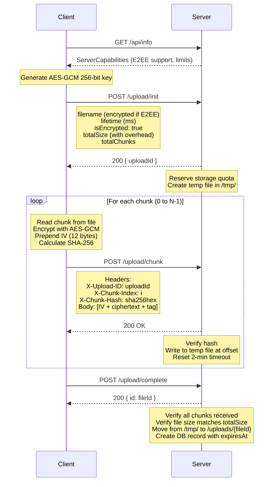
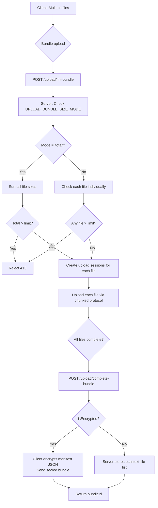

# DGUP Protocol Specification

**Dropgate Upload Protocol**

Version: 3.0.0
Protocol Identifier: DGUP
Last Updated: 2026-02-05

---

## Table of Contents

1. [Protocol Overview](#protocol-overview)
2. [Cryptographic Specification](#cryptographic-specification)
3. [Upload Session Lifecycle](#upload-session-lifecycle)
4. [Chunked Upload Flow](#chunked-upload-flow)
5. [Bundle Upload System](#bundle-upload-system)
6. [Server-Side Processing](#server-side-processing)
7. [Download and Deletion](#download-and-deletion)
8. [Zombie Upload Cleanup](#zombie-upload-cleanup)
9. [Security Guarantees](#security-guarantees)
10. [API Reference](#api-reference)
11. [Configuration Reference](#configuration-reference)
12. [Implementation Notes](#implementation-notes)

---

## Protocol Overview

**DGUP (Dropgate Upload Protocol)** is a zero-knowledge hosted file upload protocol designed for temporary, secure file sharing. It enables clients to upload encrypted files to a server that cannot decrypt or access the file contents.

### Design Philosophy

- **Server-blind architecture**: Server cannot access plaintext file content
- **Client-side encryption**: All encryption happens in the client before transmission
- **Zero-knowledge**: Encryption keys never leave the client
- **Chunked transfers**: Large files split into manageable chunks for reliability
- **Sealed manifests**: Bundle file lists can be encrypted (server-blind)

### Version History

- **v3.0.0**: Current version with sealed bundle manifests, bundle size modes
- **v2.x**: Bundle upload support
- **v1.x**: Initial implementation with single-file uploads

### Key Characteristics

| Feature | Description |
|---------|-------------|
| Encryption | AES-GCM-256 (authenticated encryption) |
| Chunk Size | 5MB default (configurable, minimum 64KB) |
| Key Storage | URL hash fragment (never transmitted to server) |
| Max File Size | Configurable (default: 100MB) |
| Expiration | Time-based and download-count-based |
| Zero-Knowledge | Server cannot decrypt without key |

---

## Cryptographic Specification

### Algorithm

**AES-256-GCM** (Advanced Encryption Standard with Galois/Counter Mode)

- **Mode**: GCM (authenticated encryption with associated data)
- **Key size**: 256 bits
- **IV size**: 12 bytes (96 bits)
- **Authentication tag**: 16 bytes (128 bits)

### Constants

| Constant | Value | Purpose |
|----------|-------|---------|
| `AES_GCM_IV_BYTES` | 12 | Initialization vector size |
| `AES_GCM_TAG_BYTES` | 16 | Authentication tag size |
| `ENCRYPTION_OVERHEAD_PER_CHUNK` | 28 | IV + tag overhead |
| `DEFAULT_CHUNK_SIZE` | 5242880 | 5MB chunk size |

*Source: [constants.ts:9-19](../../packages/dropgate-core/src/constants.ts)*

### Key Generation

Keys are generated client-side using the Web Crypto API:

```typescript
// Generate 256-bit AES-GCM key
const cryptoKey = await crypto.subtle.generateKey(
  {
    name: 'AES-GCM',
    length: 256
  },
  true,  // extractable
  ['encrypt', 'decrypt']
);

// Export to base64 for URL embedding
const keyBuffer = await crypto.subtle.exportKey('raw', cryptoKey);
const keyB64 = btoa(String.fromCharCode(...new Uint8Array(keyBuffer)));
```

**Key properties**:
- Generated using cryptographically secure random number generator
- Never transmitted to server in any form
- Stored in URL fragment (`#key=...`) which browsers don't send to server
- Single key used for entire upload (all files and filenames)

*Source: [encrypt.ts](../../packages/dropgate-core/src/crypto/encrypt.ts)*

### Encryption Process

Each chunk is encrypted independently with a unique IV:

```typescript
// 1. Generate random IV (12 bytes)
const iv = crypto.getRandomValues(new Uint8Array(12));

// 2. Encrypt plaintext chunk
const ciphertext = await crypto.subtle.encrypt(
  {
    name: 'AES-GCM',
    iv: iv
  },
  key,
  plaintextChunk
);

// 3. Combine IV + ciphertext + tag
const encryptedBlob = [iv, new Uint8Array(ciphertext)];
// ciphertext already includes the 16-byte authentication tag
```

**Output format**: `[IV (12 bytes)] + [ciphertext + auth tag (16 bytes)]`

### IV (Initialization Vector) Requirements

- **Uniqueness**: Each chunk gets a unique, random IV
- **Never reused**: Same IV+key combination never used twice
- **Cryptographically random**: Generated via `crypto.getRandomValues()`
- **Transmitted with ciphertext**: IV prepended to each encrypted chunk

### Authentication Tag

- **Implicit in GCM mode**: Automatically computed during encryption
- **Size**: 16 bytes (128 bits)
- **Purpose**: Ensures integrity and authenticity of ciphertext
- **Verification**: Automatic during decryption (fails if tampered)

### Filename Encryption

Filenames are encrypted separately using the same key:

```typescript
// Encrypt filename to base64
const encryptedFilename = await encryptFilenameToBase64(crypto, filename, key);
// Result: base64-encoded encrypted string

// Server stores: "kj3h4k5j6lm7n8=="
// Original: "document.pdf"
```

The server never sees the original filename in plaintext.

*Source: [DropgateClient.ts:660](../../packages/dropgate-core/src/client/DropgateClient.ts)*

### Size Overhead Calculation

For each chunk:
- **Plaintext size**: Up to 5MB (5,242,880 bytes)
- **IV overhead**: +12 bytes
- **Auth tag overhead**: +16 bytes
- **Total overhead**: +28 bytes per chunk

**Example**: 10MB file
- Chunks: `ceil(10,485,760 / 5,242,880) = 2`
- Overhead: `2 * 28 = 56 bytes`
- **Total upload size**: `10,485,816 bytes`

*Source: [DropgateClient.ts:62-70](../../packages/dropgate-core/src/client/DropgateClient.ts)*

---

## Upload Session Lifecycle

### Sequence Diagram



### Session States

| State | Description | Duration |
|-------|-------------|----------|
| **Initialized** | Session created, awaiting first chunk | 2 minutes |
| **Receiving** | Chunks being uploaded | 2 minutes since last chunk |
| **Completing** | All chunks received, finalizing | N/A (synchronous) |
| **Completed** | File finalized, ready for download | Until expiration |
| **Expired** | Session timeout reached | N/A (cleaned up) |

### Session Timeout Behavior

- **Timeout**: 2 minutes since last received chunk
- **Reset**: Each successful chunk upload resets the timer
- **Expiration**: If no chunks received within 2 minutes, session becomes a "zombie"
- **Cleanup**: Zombie sessions cleaned every 5 minutes (configurable)

*Source: [server.js:671-727](../../server/server.js#L671-L727)*

---

## Chunked Upload Flow

### Chunk Size

- **Default**: 5MB (5,242,880 bytes)
- **Configurable**: Via `UPLOAD_CHUNK_SIZE_BYTES` server environment variable
- **Client respects server**: Client reads chunk size from `/api/info` endpoint

### Total Chunks Calculation

```javascript
totalChunks = Math.ceil(fileSize / chunkSize)
```

**Example**:
- File: 12MB (12,582,912 bytes)
- Chunk size: 5MB (5,242,880 bytes)
- Total chunks: `ceil(12,582,912 / 5,242,880) = 3`

### Per-Chunk Encryption

For each chunk `i` from `0` to `totalChunks - 1`:

1. **Read plaintext chunk**: Read up to `chunkSize` bytes from file
2. **Generate IV**: Random 12 bytes via `crypto.getRandomValues()`
3. **Encrypt**: `ciphertext = AES-GCM-256(plaintextChunk, key, IV)`
4. **Construct blob**: `[IV (12)] + [ciphertext + tag (16)]`
5. **Hash**: `SHA-256(blob)` → hex digest
6. **Upload**: POST to `/upload/chunk` with headers

*Source: [DropgateClient.ts:_uploadFileChunks](../../packages/dropgate-core/src/client/DropgateClient.ts)*

### Server-Side Validation

For each received chunk, the server validates:

| Check | Validation | Error Response |
|-------|-----------|----------------|
| **Session exists** | `ongoingUploads.has(uploadId)` | `410 Gone` |
| **Chunk index range** | `0 <= chunkIndex < totalChunks` | `400 Bad Request` |
| **Hash format** | Regex: `/^[a-f0-9]{64}$/` (lowercase hex) | `400 Bad Request` |
| **Chunk size** | `buffer.length <= chunkSize + 1024` | `413 Payload Too Large` |
| **Hash verification** | `SHA256(buffer) === clientHash` | `400 Bad Request` |
| **Duplicate detection** | `!receivedChunks.has(chunkIndex)` | `200 OK` (skip) |

*Source: [server.js:673-691](../../server/server.js#L673-L691)*

### Sparse File Writing

Chunks are written to a sparse temporary file at calculated offsets:

```javascript
const overhead = isEncrypted ? 28 : 0;
const chunkSizeWithOverhead = CHUNK_SIZE + overhead;
const offset = chunkIndex * chunkSizeWithOverhead;

// Write to temp file at offset
fs.writeSync(fd, buffer, 0, buffer.length, offset);
```

This allows chunks to arrive out of order without corrupting the file.

### Retry Mechanism

- **Retries**: 5 attempts per chunk (default)
- **Backoff**: Exponential backoff (1s to 30s)
- **Triggering**: Network errors, timeout errors
- **Non-retriable**: Hash mismatch (indicates corruption, not network issue)

**Backoff formula**:
```javascript
backoff = Math.min(
  initialBackoff * Math.pow(2, attempt),
  maxBackoff
);
// 1s → 2s → 4s → 8s → 16s → 30s (capped)
```

*Source: [DropgateClient.ts:_attemptChunkUpload](../../packages/dropgate-core/src/client/DropgateClient.ts)*

---

## Bundle Upload System

### Bundle Size Modes

Configured via `UPLOAD_BUNDLE_SIZE_MODE` environment variable:

| Mode | Behavior | Use Case |
|------|----------|----------|
| `'total'` | Single limit applies to combined bundle size | Default, prevents large multi-file uploads |
| `'per-file'` | Limit applies to each file individually | Allow many small files |

**Example** (limit = 100MB):
- **3 files**: 35MB, 35MB, 35MB
- **Total mode**: `105MB > 100MB` → **Rejected** (413)
- **Per-file mode**: `35MB < 100MB` each → **Accepted**

### Bundle Upload Decision Flowchart



*Source: [server.js:569-587](../../server/server.js#L569-L587)*

### Sealed Bundle Manifests

For encrypted bundles, the manifest is encrypted client-side:

**Plaintext manifest**:
```json
{
  "files": [
    { "fileId": "uuid1", "name": "file1.pdf", "sizeBytes": 5000 },
    { "fileId": "uuid2", "name": "file2.txt", "sizeBytes": 3000 }
  ]
}
```

**Encryption**:
```typescript
// Client encrypts manifest with same key as files
const encryptedManifest = await encryptToBlob(crypto, manifestJSON, key);
const encryptedManifestB64 = await blobToBase64(encryptedManifest);
```

**Server storage**:
```javascript
{
  bundleId: "uuid",
  encryptedManifest: "kj3h4k5j6lm7n8...", // base64 blob
  isEncrypted: true,
  sealed: true
}
```

**Zero-knowledge guarantee**: Server cannot:
- Enumerate files in bundle
- Read file names
- Know file count or individual sizes
- Correlate files by metadata

> **Implementation detail**: For sealed (encrypted) bundles, individual files are stored independently without a `bundleId` field. Their lifecycle is time-based only, and each file gets unlimited downloads (`maxDownloads: 0`) since the bundle manifest controls discoverability. For unsealed bundles, files are tagged with `bundleId` to enable cascade deletion.

*Source: [server.js:817-906](../../server/server.js#L817-L906)*

### Unsealed Bundles

For unencrypted or unsealed bundles, the server stores plaintext metadata:

```javascript
{
  bundleId: "uuid",
  files: [
    { fileId: "uuid1", name: "file1.pdf", sizeBytes: 5000 },
    { fileId: "uuid2", name: "file2.txt", sizeBytes: 3000 }
  ],
  isEncrypted: false
}
```

Trade-off: Convenience (server can enumerate files) vs. privacy (server sees structure).

### Bundle Timeout

- **Timeout**: 10 minutes for entire bundle session
- **Sibling sync**: Each chunk received resets **all** sibling file session timers
- **Prevents orphans**: No partial bundle uploads left as zombies

**Example**: Uploading 3 files slowly
- Upload chunk for file 1 → resets timers for files 1, 2, 3
- Upload chunk for file 2 → resets timers for files 1, 2, 3
- Ensures all 3 files stay alive during slow upload

*Source: [server.js:693-703](../../server/server.js#L693-L703)*

---

## Server-Side Processing

### Storage Quota Management

| Metric | Calculation | Purpose |
|--------|-------------|---------|
| `currentDiskUsage` | `getDirSize('/uploads/')` | Track actual disk consumption |
| `reservedSpace` | `Σ ongoingUploads[i].reservedBytes` | Prevent over-provisioning |
| `availableSpace` | `maxStorage - currentDiskUsage - reservedSpace` | Capacity for new uploads |
| **Quota check** | `newFileSize > availableSpace` | Reject with 507 if insufficient |

**Update frequency**:
- `currentDiskUsage`: Synced every 5 minutes
- `reservedSpace`: Updated on each upload init/complete

**Example** (max = 100GB):
```javascript
currentDiskUsage = 85GB  // actual files
reservedSpace = 10GB     // active uploads
availableSpace = 100 - 85 - 10 = 5GB

// New upload request: 7GB
if (7GB > 5GB) {
  return 507 Insufficient Storage;
}
```

*Source: [server.js:388-495](../../server/server.js#L388-L495)*

### Database Storage

**Database type**: SQLite via [Quick.db](https://www.npmjs.com/package/quick.db)

**Storage modes**:
- **In-memory** (default): `new QuickDB({ driver: new MemoryDriver() })`
  - Data lost on server restart
  - Maximum privacy
  - Requires the `MemoryDriver` class from the `quick.db` package
- **Persistent**: `new QuickDB({ filePath: path.join(__dirname, 'uploads', 'db', 'file-database.sqlite') })`
  - Data survives restarts
  - Requires `UPLOAD_PRESERVE_UPLOADS=true`

**Database files**:
- `/server/uploads/db/file-database.sqlite` - File metadata
- `/server/uploads/db/bundle-database.sqlite` - Bundle metadata

*Source: [server.js:153-179](../../server/server.js#L153-L179)*

### File Record Schema

```typescript
interface FileRecord {
  fileId: string;           // UUID
  name: string;            // encrypted base64 or plaintext
  path: string;            // filesystem path: /uploads/{fileId}
  expiresAt: number | null; // Unix timestamp or null
  isEncrypted: boolean;     // encryption flag
  maxDownloads: number;     // 0 = unlimited
  downloadCount?: number;   // only tracked if limited
  bundleId?: string;        // UUID if part of bundle
}
```

**Key**: `fileId` (UUID)
**Access pattern**: Primary key lookups via `fileDatabase.get(fileId)`

### Bundle Record Schema

**Sealed bundle**:
```typescript
interface SealedBundleRecord {
  bundleId: string;
  encryptedManifest: string;  // base64 encrypted blob
  isEncrypted: true;
  sealed: true;
  expiresAt: number | null;
  maxDownloads: number;
  downloadCount?: number;
}
```

**Unsealed bundle**:
```typescript
interface UnsealedBundleRecord {
  bundleId: string;
  files: Array<{
    fileId: string;
    name: string;
    sizeBytes: number;
  }>;
  isEncrypted: boolean;
  expiresAt: number | null;
  maxDownloads: number;
  downloadCount?: number;
}
```

---

## Download and Deletion

### Download Decision Tree

```mermaid
flowchart TD
    A[GET /api/file/{fileId}] --> B{File exists in DB?}
    B -->|No| C[404 Not Found]
    B -->|Yes| D{File on disk?}
    D -->|No| E[404 Not Found]
    D -->|Yes| F[Stream file to client]
    F --> G{File belongs to bundle?}
    G -->|Yes| H[No download count increment<br/>Bundle tracks downloads separately]
    G -->|No| I{maxDownloads > 0?}
    I -->|No| J[No count tracking<br/>File persists]
    I -->|Yes| K[Increment downloadCount]
    K --> L{downloadCount >= maxDownloads?}
    L -->|Yes| M[Delete file + DB record<br/>Update disk usage]
    L -->|No| N[Update downloadCount in DB]
```

> **Note**: Expired files are cleaned up by the `cleanupExpiredFiles()` timer (every 60 seconds), not inline during download requests. If a file has expired but the cleanup timer hasn't run yet, the file may still be served. Once cleaned up, subsequent requests return 404.

*Source: [server.js:974-992](../../server/server.js#L974-L992)*

### Download-Triggered Deletion

After successfully streaming a file to the client:

```javascript
// Skip download counting for files that belong to a bundle
// (bundle download count is tracked separately via /api/bundle/:bundleId/downloaded)
if (fileRecord.bundleId) return;

const newDownloadCount = (fileRecord.downloadCount || 0) + 1;
const maxDl = fileRecord.maxDownloads ?? 1;

if (maxDl > 0 && newDownloadCount >= maxDl) {
  // Delete file and database record
  currentDiskUsage = Math.max(0, currentDiskUsage - fileSize);
  fs.rm(fileRecord.path, { force: true });
  fileDatabase.delete(fileId);
} else {
  // Update download count
  fileDatabase.set(fileId, { ...fileRecord, downloadCount: newDownloadCount });
}
```

> **Bundle files**: Files that belong to a bundle do not track individual download counts. Bundle downloads are tracked separately via the `POST /api/bundle/:bundleId/downloaded` endpoint, which the client calls after downloading all bundle files.

**Use cases**:
- **One-time downloads**: `maxDownloads = 1` (default)
- **Limited sharing**: `maxDownloads = 5` (delete after 5 downloads)
- **Unlimited**: `maxDownloads = 0` (never delete based on count)

### Time-Based Expiration

Every 60 seconds, `cleanupExpiredFiles()` runs:

```javascript
const allFiles = await fileDatabase.all();
for (const record of allFiles) {
  if (record.value?.expiresAt && record.value.expiresAt < Date.now()) {
    // Skip files that belong to a bundle (cleaned up with the bundle)
    if (record.value.bundleId) continue;

    const stats = fs.statSync(record.value.path);
    currentDiskUsage = Math.max(0, currentDiskUsage - stats.size);
    fs.rmSync(record.value.path, { force: true });
    await fileDatabase.delete(record.id);
  }
}
```

> **Note**: QuickDB's `.all()` returns an array of `{ id, value }` objects, not a Map iterator.

**Expiration calculation**:
```javascript
const lifetime = Math.min(clientLifetime, maxLifetimeMs);
const expiresAt = lifetime > 0 ? Date.now() + lifetime : null;
// null = never expires
```

*Source: [server.js:1282-1325](../../server/server.js#L1282-L1325)*

### Cascade Deletion (Unsealed Bundles)

When an unsealed bundle expires, all member files are cascade-deleted:

```javascript
const allBundles = await bundleDatabase.all();
for (const record of allBundles) {
  if (record.value?.expiresAt && record.value.expiresAt < now) {
    if (record.value.sealed) {
      // Sealed bundle: just delete the manifest record.
      // Member files are independent and handled by the file cleanup.
    } else {
      // Unsealed bundle: delete member files
      for (const f of (record.value.files || [])) {
        const fileInfo = await fileDatabase.get(f.fileId);
        if (fileInfo) {
          const stats = fs.statSync(fileInfo.path);
          currentDiskUsage = Math.max(0, currentDiskUsage - stats.size);
          fs.rmSync(fileInfo.path, { force: true });
          await fileDatabase.delete(f.fileId);
        }
      }
    }
    await bundleDatabase.delete(record.id);
  }
}
```

**Sealed bundles**: Only the manifest record is deleted. Member files are independent (no `bundleId` field) and expire on their own time-based expiration.

---

## Zombie Upload Cleanup

### Cleanup Mechanisms Table

| Cleanup Type | Trigger Interval | Timeout | Scope |
|--------------|------------------|---------|-------|
| **Expired files** | 60 seconds | Based on `expiresAt` timestamp | Completed uploads in DB |
| **Zombie uploads** | 300 seconds (5 min) | 2 min since last chunk | Active upload sessions |
| **Zombie bundles** | 300 seconds (5 min) | 10 min since bundle init | Active bundle sessions |
| **Download-triggered** | Immediate | After Nth download | When `downloadCount >= maxDownloads` |

### Zombie Upload Cleanup Process

Function: `cleanupZombieUploads()`
Interval: Every 300 seconds (configurable via `UPLOAD_ZOMBIE_CLEANUP_INTERVAL_MS`)

**Individual file cleanup**:
```javascript
for (const [uploadId, session] of ongoingUploads.entries()) {
  if (Date.now() > session.expiresAt) {
    // Check if part of active bundle
    if (session.bundleUploadId && ongoingBundles.has(session.bundleUploadId)) {
      continue;  // Skip, let bundle manage
    }

    // Orphan or bundle dead - clean up
    fs.rmSync(session.tempFilePath, { force: true });
    ongoingUploads.delete(uploadId);

    // Release reserved storage
    // (handled automatically when removed from Map)
  }
}
```

**Bundle cleanup**:
```javascript
for (const [bundleId, bundleSession] of ongoingBundles.entries()) {
  if (Date.now() > bundleSession.expiresAt) {
    // Clean up all sibling upload sessions
    for (const fileUploadId of bundleSession.fileUploadIds) {
      const uploadSession = ongoingUploads.get(fileUploadId);
      if (uploadSession) {
        fs.rmSync(uploadSession.tempFilePath, { force: true });
        ongoingUploads.delete(fileUploadId);
      }
    }

    // Clean up any already-completed files
    for (const completedFile of bundleSession.completedFileResults) {
      const fileRecord = fileDatabase.get(completedFile.fileId);
      if (fileRecord) {
        fs.rmSync(fileRecord.path, { force: true });
        fileDatabase.delete(completedFile.fileId);
      }
    }

    ongoingBundles.delete(bundleId);
  }
}
```

*Source: [server.js:1327-1370](../../server/server.js#L1327-L1370)*

### Why Zombie Cleanup Matters

**Problem**: Client disconnects mid-upload, leaving:
- Temporary files in `/uploads/tmp/`
- Reserved storage quota (prevents new uploads)
- In-memory session state

**Solution**: Periodic cleanup of expired sessions:
- Frees disk space
- Releases reserved quota
- Prevents memory leaks

**Timeout reasoning**:
- **2 minutes**: Reasonable for slow connections, not too long to hold resources
- **10 minutes** (bundles): Allows time for multiple file uploads
- **5-minute cleanup**: Balance between responsiveness and overhead

---

## Security Guarantees

### Server Blindness Matrix

| Data Type | Server Can See | Server Cannot See |
|-----------|----------------|-------------------|
| **File content** | Encrypted blob | ✅ Plaintext content |
| **Encryption key** | ❌ Never transmitted | ✅ Key (URL fragment) |
| **Filename** | Encrypted base64 string | ✅ Original filename |
| **File size** | ✅ Total size with overhead | ❌ (deducible from size) |
| **Bundle structure (sealed)** | Encrypted manifest blob | ✅ File count, names, sizes |
| **Bundle structure (unsealed)** | ✅ Full file list | ❌ Server stores plaintext |
| **Download key** | ❌ URL fragment not sent | ✅ Client-side only |
| **Upload timestamp** | ✅ Implicit in `expiresAt` | ❌ Metadata leakage |
| **Download count** | ✅ Tracked for deletion | ❌ Metadata leakage |

### Zero-Knowledge Architecture

**Definition**: A system where the server operator cannot access the plaintext content of user data, even with full server access.

**DGUP implementation**:
1. **Client-side encryption**: Files encrypted before transmission
2. **Key isolation**: Keys stored in URL fragment (never sent in HTTP request)
3. **Encrypted filenames**: Server sees `"kj3h4k5j6=="`, not `"document.pdf"`
4. **Sealed manifests**: Bundle structure encrypted (server-blind)
5. **No key escrow**: No mechanism for server to recover keys

**Limitations**:
- Server can see file sizes (required for quota management)
- Server can see upload/download timing (metadata leakage)
- For unsealed bundles, server can see file list

### Chunk Integrity Verification

**SHA-256 hashing**:
```javascript
// Client computes hash of encrypted chunk
const hash = await crypto.subtle.digest('SHA-256', encryptedChunkBlob);
const hashHex = Array.from(new Uint8Array(hash))
  .map(b => b.toString(16).padStart(2, '0'))
  .join('');

// Send hash in header
headers['X-Chunk-Hash'] = hashHex;
```

**Server verification**:
```javascript
const receivedHash = req.headers['x-chunk-hash'];
const computedHash = crypto.createHash('sha256').update(buffer).digest('hex');

if (receivedHash !== computedHash) {
  return res.status(400).json({ error: 'Chunk hash mismatch' });
}
```

**Security benefit**: Detects corruption or tampering without server seeing plaintext.

### Replay Attack Prevention

**Session-based isolation**:
- Each upload gets unique `uploadId` (UUID)
- Chunks tied to specific session
- Sessions expire after 2 minutes of inactivity
- No cross-session chunk acceptance

**No inherent replay protection**: If an attacker captures encrypted chunks, they could replay them to the same session. However:
- Sessions are short-lived (2-minute timeout)
- Duplicate chunks are silently skipped (idempotent)
- Attack window is minimal

### No User Tracking

**By design**:
- No user accounts or authentication
- No session cookies
- No IP logging (default log level)
- No cross-upload correlation

**Privacy model**: Each upload is independent and anonymous.

---

## API Reference

### DGUP Protocol Endpoints

| Endpoint | Method | Purpose | Request Body | Success Response | Error Responses |
|----------|--------|---------|--------------|------------------|-----------------|
| `/api/info` | GET | Server capabilities | - | `200 { name, version, logLevel, capabilities: { upload: {...}, p2p: {...}, webUI: {...} } }` | - |
| `/upload/init` | POST | Start single file upload | `{ filename, lifetime, isEncrypted, totalSize, totalChunks, maxDownloads }` | `200 { uploadId }` | `400`, `507`, `413` |
| `/upload/init-bundle` | POST | Start multi-file bundle | `{ fileCount, files: [...], lifetime, isEncrypted, maxDownloads }` | `200 { bundleUploadId, fileUploadIds: [...] }` | `400`, `507`, `413` |
| `/upload/chunk` | POST | Upload encrypted chunk | Binary blob (body)<br/>Headers: `X-Upload-ID`, `X-Chunk-Index`, `X-Chunk-Hash` | `200 OK` | `400`, `410`, `413` |
| `/upload/complete` | POST | Finalize file upload | `{ uploadId }` | `200 { id }` | `400`, `410` |
| `/upload/complete-bundle` | POST | Finalize bundle | `{ bundleUploadId, encryptedManifest? }` | `200 { bundleId }` | `400`, `410` |
| `/upload/cancel` | POST | Abort upload | `{ uploadId }` | `200 OK` | `400`, `404` |

### Request/Response Examples

**GET `/api/info`** (upload capabilities portion):
```json
// Response
{
  "name": "Dropgate Server",
  "version": "3.0.0",
  "logLevel": "INFO",
  "capabilities": {
    "upload": {
      "enabled": true,
      "maxSizeMB": 100,
      "bundleSizeMode": "total",
      "maxLifetimeHours": 24,
      "maxFileDownloads": 1,
      "e2ee": true,
      "chunkSize": 5242880
    }
  }
}
```

**POST `/upload/init`**:
```json
// Request
{
  "filename": "kj3h4k5j6lm7n8==",  // encrypted base64
  "lifetime": 86400000,            // 24 hours in ms
  "isEncrypted": true,
  "totalSize": 10485816,           // 10MB + 56 bytes overhead
  "totalChunks": 2,
  "maxDownloads": 1
}

// Response
{
  "uploadId": "3aac88a3-7f24-4378-91d2-3d76ede1870d"
}
```

**POST `/upload/chunk`**:
```http
POST /upload/chunk HTTP/1.1
X-Upload-ID: 3aac88a3-7f24-4378-91d2-3d76ede1870d
X-Chunk-Index: 0
X-Chunk-Hash: a1b2c3d4e5f6789...

[Binary data: IV (12 bytes) + ciphertext + tag (16 bytes)]
```

**POST `/upload/complete-bundle`**:
```json
// Request (sealed bundle)
{
  "bundleUploadId": "bundle-uuid",
  "encryptedManifest": "kj3h4k5j6lm7n8p9..."  // base64 encrypted JSON
}

// Response
{
  "bundleId": "bundle-uuid-final"
}
```

*Source: [server.js:388-906](../../server/server.js#L388-L906)*

---

## Configuration Reference

### DGUP Environment Variables

| Variable | Type | Default | Range | Description |
|----------|------|---------|-------|-------------|
| `ENABLE_UPLOAD` | boolean | `false` | - | Enable hosted uploads |
| `UPLOAD_MAX_FILE_SIZE_MB` | number | `100` | 0-∞ | Max file size (MB), 0 = unlimited |
| `UPLOAD_MAX_STORAGE_GB` | number | `10` | 0-∞ | Total storage quota (GB), 0 = unlimited |
| `UPLOAD_MAX_FILE_LIFETIME_HOURS` | number | `24` | 0-∞ | Max file lifetime (hours), 0 = unlimited |
| `UPLOAD_MAX_FILE_DOWNLOADS` | number | `1` | 0-∞ | Max downloads per file, 0 = unlimited |
| `UPLOAD_CHUNK_SIZE_BYTES` | number | `5242880` | 65536-∞ | Chunk size (bytes), default 5MB, minimum 64KB |
| `UPLOAD_BUNDLE_SIZE_MODE` | string | `'total'` | `'total'` \| `'per-file'` | Bundle limit mode |
| `UPLOAD_PRESERVE_UPLOADS` | boolean | `false` | - | Persist uploads across restarts |
| `UPLOAD_ENABLE_E2EE` | boolean | `true` | - | Enable end-to-end encryption |
| `UPLOAD_ZOMBIE_CLEANUP_INTERVAL_MS` | number | `300000` | 1000-∞ | Zombie cleanup interval (ms), default 5 min |

### Client Configuration Options

```typescript
// DropgateClient constructor (server set once)
const client = new DropgateClient({
  clientVersion: '3.0.0',
  server: 'https://dropgate.link',  // URL string or ServerTarget object
});

// Upload options (passed to client.uploadFiles())
interface UploadFilesOptions {
  // File options
  files: FileSource[];
  lifetime?: number;           // milliseconds, server may cap
  maxDownloads?: number;       // 0 = unlimited

  // Encryption
  encrypt?: boolean;           // default: true if server supports E2EE

  // Callbacks
  onProgress?: (event: UploadProgressEvent) => void;
  onSessionCreated?: (session: UploadSession) => void;
}
```

*Source: [types.ts](../../packages/dropgate-core/src/types.ts)*

---

## Implementation Notes

### Critical Files

| File | Purpose | Lines |
|------|---------|-------|
| [DropgateClient.ts](../../packages/dropgate-core/src/client/DropgateClient.ts) | Client upload logic, session management | 1603 lines |
| [encrypt.ts](../../packages/dropgate-core/src/crypto/encrypt.ts) | AES-GCM encryption implementation | - |
| [decrypt.ts](../../packages/dropgate-core/src/crypto/decrypt.ts) | AES-GCM decryption implementation | - |
| [constants.ts](../../packages/dropgate-core/src/constants.ts) | Encryption constants and defaults | 27 lines |
| [server.js](../../server/server.js) | Server-side upload handling | Lines 388-906 (upload), 1282-1370 (cleanup) |
| [types.ts](../../packages/dropgate-core/src/types.ts) | TypeScript type definitions | - |

### Implementation Checklist

For implementing a compatible DGUP client:

- [ ] Generate AES-GCM-256 key using Web Crypto API
- [ ] Encrypt each chunk with unique IV
- [ ] Calculate SHA-256 hash of encrypted chunks
- [ ] Implement exponential backoff retry logic
- [ ] Handle 507 (insufficient storage) gracefully
- [ ] Embed key in URL fragment (`#key=...`)
- [ ] Support bundle uploads with sealed manifests
- [ ] Respect server chunk size from `/api/info`
- [ ] Implement session timeout awareness (2 min)
- [ ] Encrypt filenames before sending to server

### Testing Recommendations

1. **Encryption correctness**: Verify roundtrip encrypt/decrypt
2. **Chunk boundary conditions**: Test file sizes at exact chunk multiples
3. **Network resilience**: Test retry logic with simulated failures
4. **Quota enforcement**: Test upload rejection at capacity limits
5. **Concurrent uploads**: Test multiple simultaneous uploads
6. **Zombie cleanup**: Test abandoned upload cleanup
7. **Bundle uploads**: Test both sealed and unsealed bundles
8. **Expiration**: Test time-based and download-based deletion

### Known Limitations

1. **No resume support**: Interrupted uploads must restart from beginning
2. **No partial chunk upload**: Chunks are atomic (all or nothing)
3. **Fixed chunk size**: Cannot dynamically adjust chunk size during upload
4. **Single key per upload**: Cannot use different keys for different files in bundle
5. **Metadata leakage**: File sizes and timing visible to server

---

**End of DGUP Protocol Specification**

For questions or contributions, see the [main documentation index](./README.md).
